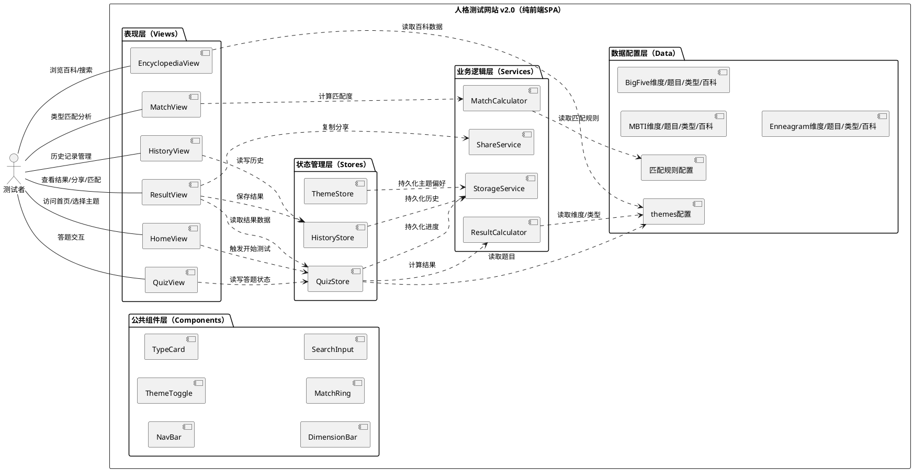
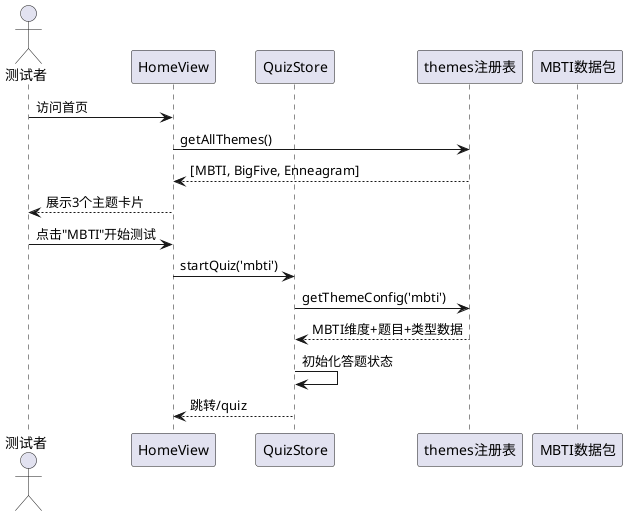
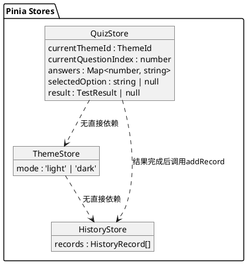

# **1. 实现模型**

## **1.1 上下文视图**

本应用为纯前端单页应用（SPA），无后端依赖。用户通过浏览器直接访问，所有逻辑在客户端完成。扩展版在基础版本上新增类型百科、类型匹配、历史记录、明暗主题、交互动效五大模块。



### 系统边界说明

| 边界项 | 说明 |
|--------|------|
| 浏览器环境 | 应用运行在用户浏览器中，依赖 Vue 3 运行时 |
| localStorage | 唯一的外部存储依赖，用于答题进度、历史记录、主题偏好持久化；不可用时降级为无恢复功能 |
| 剪贴板 API | 分享功能依赖 `navigator.clipboard` API；不可用时降级为手动选择复制 |
| CSS媒体查询 | `prefers-color-scheme` 跟随系统主题；`prefers-reduced-motion` 减弱动效 |
| 无服务端依赖 | 不发送任何网络请求，不收集用户数据 |

## **1.2 服务/组件总体架构**

### 1.2.1 技术栈

| 类别 | 技术选型 | 版本要求 | 选型理由 |
|------|---------|---------|---------|
| 前端框架 | Vue 3 + Composition API | ^3.4 | 轻量级、高性能，`<script setup>` 语法简洁高效 |
| 构建工具 | Vite | ^5.x | 极速冷启动、原生 ESM 支持、代码分割优化 |
| 路由 | Vue Router | ^4.x | Vue 官方路由方案，支持路由守卫、路由过渡、懒加载 |
| 状态管理 | Pinia | ^2.x | Vue 3 官方推荐，TypeScript 友好，多Store协作清晰 |
| 样式方案 | CSS/SCSS + CSS自定义属性 | - | CSS变量实现明暗主题全局切换，SCSS辅助嵌套与复用 |
| 类型系统 | TypeScript | ^5.x | 强类型保障，避免 `any`，提升跨组件类型安全 |
| 部署方式 | 静态站点（CDN） | - | 纯前端产物，零服务端依赖 |

### 1.2.2 目录结构（扩展版）

```
personality-test/
├── index.html
├── vite.config.ts
├── tsconfig.json
├── package.json
├── src/
│   ├── App.vue                        # 根组件（含NavBar、路由过渡）
│   ├── main.ts                        # 应用入口
│   ├── router/
│   │   └── index.ts                   # 路由配置与守卫（含懒加载）
│   ├── stores/
│   │   ├── quiz.ts                    # 答题状态管理（扩展多主题）
│   │   ├── theme.ts                   # 明暗主题状态管理（新增）
│   │   └── history.ts                 # 历史记录状态管理（新增）
│   ├── services/
│   │   ├── resultCalculator.ts        # 结果计算服务（扩展多主题）
│   │   ├── matchCalculator.ts         # 类型匹配计算服务（新增）
│   │   ├── shareService.ts            # 分享/剪贴板服务（扩展含主题名）
│   │   └── storageService.ts          # localStorage 封装服务（扩展多KEY）
│   ├── data/
│   │   ├── themes.ts                  # 测试主题元数据注册表（新增）
│   │   ├── mbti/
│   │   │   ├── dimensions.ts          # MBTI维度配置
│   │   │   ├── questions.ts           # MBTI题目配置
│   │   │   ├── types.ts               # MBTI类型描述+专属配色+百科配置
│   │   │   └── matchRules.ts          # MBTI匹配规则配置
│   │   ├── bigfive/
│   │   │   ├── dimensions.ts          # 大五人格维度配置
│   │   │   ├── questions.ts           # 大五人格题目配置
│   │   │   ├── types.ts               # 大五人格类型描述+专属配色+百科配置
│   │   │   └── matchRules.ts          # 大五人格匹配规则配置
│   │   └── enneagram/
│   │       ├── dimensions.ts          # 九型人格维度配置
│   │       ├── questions.ts           # 九型人格题目配置
│   │       ├── types.ts               # 九型人格类型描述+专属配色+百科配置
│   │       └── matchRules.ts          # 九型人格匹配规则配置
│   ├── types/
│   │   └── index.ts                   # 全局 TypeScript 类型定义（扩展）
│   ├── views/
│   │   ├── HomeView.vue               # 首页（主题卡片选择，原WelcomeView重构）
│   │   ├── QuizView.vue               # 答题页面（扩展多主题）
│   │   ├── ResultView.vue             # 结果页面（扩展专属配色+匹配入口）
│   │   ├── EncyclopediaView.vue       # 类型百科页面（新增）
│   │   ├── MatchView.vue              # 类型匹配页面（新增）
│   │   └── HistoryView.vue            # 历史记录页面（新增）
│   ├── components/
│   │   ├── NavBar.vue                 # 全局导航栏（新增）
│   │   ├── ThemeToggle.vue            # 明暗主题切换按钮（新增）
│   │   ├── ThemeCard.vue              # 测试主题卡片（新增）
│   │   ├── TypeCard.vue               # 类型百科卡片（新增）
│   │   ├── TypeDetail.vue             # 类型详情展示（新增）
│   │   ├── SearchInput.vue            # 搜索输入框（新增）
│   │   ├── MatchRing.vue              # 匹配度环形图（新增）
│   │   ├── DimensionBar.vue           # 维度得分可视化条（保留+增强）
│   │   ├── ProgressBar.vue            # 答题进度条（保留）
│   │   ├── QuestionCard.vue           # 题目卡片（保留+增强动画）
│   │   ├── OptionButton.vue           # 选项按钮（保留+增强动画）
│   │   ├── ToastMessage.vue           # 提示消息（保留）
│   │   └── EmptyState.vue             # 空状态占位（新增）
│   └── styles/
│       ├── variables.scss             # CSS变量定义（扩展暗色变量集）
│       ├── themes.scss                # 明暗主题CSS变量切换（新增）
│       ├── mixins.scss                # SCSS混入（保留）
│       ├── transitions.scss           # 路由/组件过渡动画（新增）
│       └── global.scss                # 全局样式（保留+扩展）
```

### 1.2.3 架构分层图

```plantuml
@startuml
@startuml
top to bottom direction

package "视图层 (Views)" as views {
  [HomeView] -- [QuizView] -- [ResultView]
  [EncyclopediaView] -- [MatchView] -- [HistoryView]
}

package "组件层 (Components)" as components {
  [NavBar + ThemeToggle]
  [ThemeCard / TypeCard / TypeDetail]
  [SearchInput / MatchRing / DimensionBar]
  [ProgressBar / QuestionCard / OptionButton]
  [ToastMessage / EmptyState]
}

package "状态层 (Pinia Stores)" as stores {
  [QuizStore] -- [ThemeStore] -- [HistoryStore]
}

package "服务层 (Services)" as services {
  [ResultCalculator] -- [MatchCalculator]
  [ShareService] -- [StorageService]
}

package "数据层 (Data)" as data {
  [themes注册表]
  [mbti配置集]
  [bigfive配置集]
  [enneagram配置集]
}

views --> components : "组合渲染"
views --> stores : "读写状态"
stores --> services : "调用逻辑"
services --> data : "读取配置"
stores --> data : "读取配置"

@enduml
@enduml
```

## **1.3 实现设计文档**

### 1.3.1 多套测试主题（P0）

#### 设计思路

将现有单套MBTI硬编码数据重构为**主题注册表 + 主题数据包**模式。每个主题提供独立的维度、题目、类型、百科和匹配规则数据文件，通过统一的 `ThemeConfig` 接口注册到 `themes.ts` 注册表中。QuizStore 和 ResultCalculator 通过当前选中主题动态引用对应数据包，无需修改业务逻辑即可新增主题。

#### 组件交互



#### 关键实现点

1. **themes.ts 注册表**：导出 `ThemeMeta[]` 数组和 `getThemeConfig(id: ThemeId): ThemeConfig` 函数
2. **QuizStore 扩展**：新增 `currentThemeId: Ref<ThemeId>` 字段，`startQuiz(themeId)` 接收主题参数，所有数据引用通过 `getThemeConfig(currentThemeId)` 动态获取
3. **HomeView 重构**：替代原 WelcomeView，展示主题卡片列表，每卡片含名称、描述、题数、耗时、开始按钮
4. **答题进度持久化扩展**：QuizProgress 类型新增 `themeId` 字段，恢复进度时同步恢复主题

### 1.3.2 类型百科（P0）

#### 设计思路

新增 EncyclopediaView 页面，内含主题选择器、搜索框和类型卡片列表。类型百科数据内嵌于各主题的 `types.ts` 配置文件中（`TypeEncyclopedia` 接口），无需独立数据源。搜索基于名称和核心特质标签的本地筛选。

#### 页面结构

```
EncyclopediaView
├── 主题选择器（Tab/Select，3个主题标签）
├── SearchInput（搜索框，实时过滤）
├── 类型卡片列表（TypeCard[]，响应式网格布局）
│   └── TypeCard（名称+核心特质标签+专属配色缩略）
└── TypeDetail（点击卡片展开详情弹窗/面板）
    ├── 类型名称 + 别名
    ├── 核心特质
    ├── 优势列表
    ├── 劣势列表
    ├── 典型职业列表
    └── 最佳匹配类型
```

#### 关键实现点

1. **主题切换**：响应式变量 `selectedThemeId`，切换时重新加载对应主题的百科数据
2. **搜索过滤**：`computed` 计算属性，根据关键词过滤 `types.filter(t => t.name.includes(kw) || t.traits.some(tr => tr.includes(kw)))`
3. **空搜索结果**：使用 EmptyState 组件展示"未找到匹配的人格类型"
4. **类型详情展示**：TypeDetail 组件接收 `TypeEncyclopedia` 数据，以弹窗或面板形式展示完整信息

### 1.3.3 类型匹配（P1）

#### 设计思路

新增 MatchView 页面和 MatchCalculator 服务。匹配度基于各维度极的一致性与互补性规则计算，规则配置化定义在各主题的 `matchRules.ts` 中。匹配度计算公式：

- **同维同极**（一致）：该维度贡献较高匹配分
- **同维异极**（互补）：根据规则表判断该维度对匹配的正/负贡献
- **总匹配度** = 各维度匹配分之和 / 维度数 × 100%

#### 匹配算法设计

```typescript
// 匹配规则配置
interface MatchRule {
  dimensionId: string
  // 极组合 → 匹配贡献分 (0~1)
  polePairs: Record<string, number>  // key: "E-E", "E-I" 等
}

// 匹配计算
function calculateMatch(
  typeA: string, typeB: string,
  dimensions: Dimension[], rules: MatchRule[]
): MatchResult {
  // 1. 解析两类型的维度极组合
  // 2. 逐维度查规则表获取匹配贡献分
  // 3. 求平均 × 100% = 总匹配度
  // 4. 生成各维度匹配分析描述
}
```

#### 页面结构

```
MatchView
├── 类型A选择器（预选用户结果类型，可切换）
├── 类型B选择器（同主题所有类型下拉选择）
├── MatchRing（匹配度环形进度图 + 百分比数字）
├── 匹配分析描述文本
└── 各维度匹配分析列表
    └── 维度名 + A极/B极 + 一致/互补标签
```

### 1.3.4 历史记录（P1）

#### 设计思路

新增 HistoryStore 管理历史记录的 CRUD 操作，数据持久化至 localStorage。HistoryStore 维护 `records: Ref<HistoryRecord[]>` 响应式数组，所有变更同步写入 localStorage。

#### 数据结构

```typescript
interface HistoryRecord {
  id: string               // 唯一标识（timestamp + random）
  timestamp: string        // ISO 8601 格式
  themeId: ThemeId         // 测试主题标识
  typeId: string           // 人格类型标识
  typeName: string         // 人格类型名称
  typeDescription: string  // 类型描述
  dimensionScores: DimensionScore[]  // 维度得分快照
  typeColors: TypeColors   // 专属配色快照
}
```

#### 关键实现点

1. **自动保存**：ResultView 计算结果后调用 `historyStore.addRecord(record)`
2. **上限管理**：`addRecord` 时检查数量，超过20条则 `shift()` 移除最旧记录
3. **时间倒序**：`computed(() => records.sort((a,b) => b.timestamp.localeCompare(a.timestamp)))`
4. **详情回看**：点击记录进入路由 `/history/:id`，从 HistoryStore 读取完整数据渲染结果
5. **删除/清空**：`removeRecord(id)` 和 `clearAll()` 操作同步更新 localStorage
6. **空状态**：无记录时使用 EmptyState 组件展示"暂无测试记录"和"去测试"按钮

### 1.3.5 明暗主题切换（P1）

#### 设计思路

新增 ThemeStore 管理 `mode: Ref<'light' | 'dark'>` 状态。首次访问检测 `window.matchMedia('(prefers-color-scheme: dark)')` 跟随系统偏好，用户手动切换后持久化至 localStorage。主题切换通过修改 `<html>` 元素的 `data-theme` 属性，配合 CSS 变量选择器实现全局切换。

#### CSS 变量方案

```scss
// variables.scss — 亮色主题（默认）
:root,
[data-theme="light"] {
  --color-primary: #4A6CF7;
  --color-primary-light: #6B8AFF;
  --color-primary-dark: #3451DB;
  --color-bg: #F8F9FC;
  --color-surface: #FFFFFF;
  --color-text: #1A1A2E;
  --color-text-secondary: #6B7280;
  --color-border: #E5E7EB;
  --color-success: #10B981;
  --color-warning: #F59E0B;
  --color-dimension-a: #4A6CF7;
  --color-dimension-b: #F472B6;
  --shadow-card: 0 2px 12px rgba(0, 0, 0, 0.06);
}

// 暗色主题
[data-theme="dark"] {
  --color-primary: #6B8AFF;
  --color-primary-light: #8BA4FF;
  --color-primary-dark: #4A6CF7;
  --color-bg: #0F0F1A;
  --color-surface: #1A1A2E;
  --color-text: #E5E7EB;
  --color-text-secondary: #9CA3AF;
  --color-border: #374151;
  --color-success: #34D399;
  --color-warning: #FBBF24;
  --color-dimension-a: #6B8AFF;
  --color-dimension-b: #F9A8D4;
  --shadow-card: 0 2px 12px rgba(0, 0, 0, 0.3);
}
```

#### 关键实现点

1. **ThemeStore**：`initTheme()` 从 localStorage 读取或检测系统偏好，`toggleTheme()` 切换并持久化
2. **初始化时机**：`main.ts` 中 `app.mount()` 前调用 `themeStore.initTheme()`，避免闪烁
3. **全局 NavBar**：ThemeToggle 按钮嵌入 NavBar，所有页面共享
4. **CSS 变量继承**：所有组件样式使用 `var(--color-xxx)` 引用，切换主题后自动生效

### 1.3.6 交互动效（P2）

#### 设计思路

使用 Vue `<Transition>` 和 CSS `transition` 实现动效，尊重 `prefers-reduced-motion` 媒体查询。

#### 动效规格

| 场景 | 动效类型 | 时长 | CSS实现 |
|------|---------|------|---------|
| 题目切换 | 滑出左/滑入右 | ≤400ms | `transform: translateX()` + `opacity` |
| 选项选中 | 缩放弹跳 | ≤200ms | `transform: scale()` + `border-color` |
| 路由切换 | 淡入淡出 | ≤300ms | `opacity` 过渡 |
| 百科卡片悬停 | 微上浮+阴影 | ≤200ms | `transform: translateY(-4px)` + `box-shadow` |

#### 减弱动效偏好

```scss
// transitions.scss
@media (prefers-reduced-motion: reduce) {
  *, *::before, *::after {
    animation-duration: 0.01ms !important;
    transition-duration: 0.01ms !important;
  }
}
```

---

# **2. 接口设计**

## **2.1 总体设计**

本应用为纯前端SPA，无对外API接口。内部接口设计指组件间Props/Emits、Store公开方法、Service公开函数的契约定义。

## **2.2 接口清单**

### 2.2.1 Store 公开接口

#### QuizStore（扩展版）

| 接口 | 类型 | 签名 | 说明 |
|------|------|------|------|
| currentThemeId | State | `Ref<ThemeId>` | 当前测试主题标识 |
| currentQuestionIndex | State | `Ref<number>` | 当前题目索引 |
| answers | State | `Ref<Map<number, string>>` | 已答题目映射 |
| selectedOption | State | `Ref<string \| null>` | 当前选中选项ID |
| result | State | `Ref<TestResult \| null>` | 计算结果 |
| currentQuestion | Computed | `ComputedRef<Question>` | 当前题目对象 |
| totalQuestions | Computed | `ComputedRef<number>` | 当前主题题目总数 |
| progress | Computed | `ComputedRef<string>` | 进度文本"N/M" |
| isQuizComplete | Computed | `ComputedRef<boolean>` | 是否完成所有题目 |
| isLastQuestion | Computed | `ComputedRef<boolean>` | 是否最后一题 |
| currentThemeName | Computed | `ComputedRef<string>` | 当前主题名称 |
| startQuiz | Action | `(themeId: ThemeId) => void` | 以指定主题开始测试 |
| selectOption | Action | `(optionId: string) => void` | 选择当前题目选项 |
| goToNext | Action | `() => boolean` | 进入下一题/完成 |
| calculateResult | Action | `() => TestResult` | 计算测试结果 |
| resetQuiz | Action | `() => void` | 重置答题状态 |
| restoreProgress | Action | `() => boolean` | 从localStorage恢复进度 |
| hasInProgress | Action | `() => boolean` | 检测是否有未完成进度 |

#### ThemeStore（新增）

| 接口 | 类型 | 签名 | 说明 |
|------|------|------|------|
| mode | State | `Ref<'light' \| 'dark'>` | 当前主题模式 |
| isDark | Computed | `ComputedRef<boolean>` | 是否暗色模式 |
| initTheme | Action | `() => void` | 初始化主题（localStorage > 系统偏好 > 默认亮色） |
| toggleTheme | Action | `() => void` | 切换明暗主题 |

#### HistoryStore（新增）

| 接口 | 类型 | 签名 | 说明 |
|------|------|------|------|
| records | State | `Ref<HistoryRecord[]>` | 历史记录数组 |
| sortedRecords | Computed | `ComputedRef<HistoryRecord[]>` | 按时间倒序排列 |
| hasRecords | Computed | `ComputedRef<boolean>` | 是否有历史记录 |
| addRecord | Action | `(record: Omit<HistoryRecord, 'id'>) => void` | 添加记录（超上限自动淘汰最旧） |
| removeRecord | Action | `(id: string) => void` | 删除单条记录 |
| clearAll | Action | `() => void` | 清空所有记录 |
| getRecordById | Action | `(id: string) => HistoryRecord \| undefined` | 按ID查找记录 |
| loadFromStorage | Action | `() => void` | 从localStorage加载 |

### 2.2.2 Service 公开接口

#### ResultCalculator（扩展版）

| 接口 | 签名 | 说明 |
|------|------|------|
| calculate | `(answers: Map<number, string>, dims: Dimension[], qs: Question[], types: PersonalityType[]) => TestResult` | 根据答题数据计算维度得分和人格类型 |

#### MatchCalculator（新增）

| 接口 | 签名 | 说明 |
|------|------|------|
| calculateMatch | `(typeAId: string, typeBId: string, themeId: ThemeId) => MatchResult` | 计算两类型匹配度 |
| getMatchDescription | `(matchPercent: number) => string` | 根据匹配度生成总体描述 |
| getDimensionAnalysis | `(dimA: string, dimB: string, rule: MatchRule) => DimensionMatchAnalysis` | 单维度匹配分析 |

#### ShareService（扩展版）

| 接口 | 签名 | 说明 |
|------|------|------|
| generateSummary | `(result: TestResult, themeName: string) => string` | 生成含主题名称的摘要文本 |
| copyResult | `(result: TestResult, themeName: string) => Promise<boolean>` | 复制结果到剪贴板 |

#### StorageService（扩展版）

| 接口 | 签名 | 说明 |
|------|------|------|
| isAvailable | `() => boolean` | 检测localStorage可用性 |
| saveProgress | `(data: QuizProgress) => void` | 保存答题进度 |
| loadProgress | `() => QuizProgress \| null` | 加载答题进度 |
| clearProgress | `() => void` | 清除答题进度 |
| saveHistory | `(records: HistoryRecord[]) => void` | 保存历史记录（新增） |
| loadHistory | `() => HistoryRecord[]` | 加载历史记录（新增） |
| saveTheme | `(mode: 'light' \| 'dark') => void` | 保存主题偏好（新增） |
| loadTheme | `() => 'light' \| 'dark' \| null` | 加载主题偏好（新增） |

### 2.2.3 核心组件 Props/Emits 接口

#### NavBar

| Props | 类型 | 说明 |
|-------|------|------|
| 无 | - | 通过 `useRoute()` 自动高亮当前路由 |

#### ThemeToggle

| Props | 类型 | 说明 |
|-------|------|------|
| 无 | - | 通过 ThemeStore 读写主题状态 |

#### ThemeCard（主题卡片）

| Props | 类型 | 说明 |
|-------|------|------|
| theme | `ThemeMeta` | 主题元数据 |
| Emits | 类型 | 说明 |
| select | `(themeId: ThemeId) => void` | 点击开始测试 |

#### TypeCard（类型百科卡片）

| Props | 类型 | 说明 |
|-------|------|------|
| type | `TypeEncyclopedia` | 类型百科数据 |
| colors | `TypeColors` | 专属配色 |
| Emits | 类型 | 说明 |
| click | `() => void` | 点击查看详情 |

#### TypeDetail（类型详情）

| Props | 类型 | 说明 |
|-------|------|------|
| type | `TypeEncyclopedia` | 类型百科完整数据 |
| colors | `TypeColors` | 专属配色 |
| visible | `boolean` | 是否展示 |

#### SearchInput

| Props | 类型 | 说明 |
|-------|------|------|
| placeholder | `string` | 占位文本 |
| modelValue | `string` | 双向绑定搜索关键词 |
| Emits | 类型 | 说明 |
| update:modelValue | `(value: string) => void` | 输入变更 |

#### MatchRing（匹配度环形图）

| Props | 类型 | 说明 |
|-------|------|------|
| percent | `number` | 匹配度百分比(0~100) |
| color | `string` | 环形图颜色 |

#### EmptyState

| Props | 类型 | 说明 |
|-------|------|------|
| message | `string` | 空状态提示文案 |
| actionText | `string` | 操作按钮文案 |
| Emits | 类型 | 说明 |
| action | `() => void` | 点击操作按钮 |

---

# **4. 数据模型**

## **4.1 设计目标**

1. **类型安全**：所有数据结构以 TypeScript 接口严格定义，禁止 `any`
2. **配置化**：测试主题、维度、题目、类型、百科、匹配规则均以静态配置定义，新增主题无需改动业务逻辑
3. **持久化兼容**：历史记录和答题进度数据结构支持 JSON 序列化/反序列化
4. **扩展性**：核心接口预留扩展字段，支持未来新增主题或功能模块

## **4.2 模型实现**

### 4.2.1 主题与维度模型

```typescript
/** 测试主题标识 */
type ThemeId = 'mbti' | 'bigfive' | 'enneagram'

/** 测试主题元数据（首页卡片展示） */
interface ThemeMeta {
  id: ThemeId
  name: string            // 主题名称，如"MBTI人格测试"
  description: string     // 主题简要描述，≤200字符
  questionCount: number   // 题目数量
  estimatedTime: string   // 预计耗时，如"约3分钟"
  icon: string            // 主题图标emoji或标识
}

/** 测试主题完整配置（内部使用） */
interface ThemeConfig {
  meta: ThemeMeta
  dimensions: Dimension[]
  questions: Question[]
  types: PersonalityType[]
  encyclopedia: TypeEncyclopedia[]
  matchRules: MatchRule[]
}

/** 人格维度 */
interface Dimension {
  id: string              // 维度标识，如"EI"
  name: string            // 维度名称，如"能量方向"
  poleAName: string       // 极A名称，如"外向"
  poleBName: string       // 极B名称，如"内向"
  poleAKey: string        // 极A标识，如"E"
  poleBKey: string        // 极B标识，如"I"
}
```

### 4.2.2 题目与选项模型

```typescript
/** 维度极标识 */
type PoleId = 'A' | 'B'

/** 题目选项 */
interface QuestionOption {
  id: string              // 选项标识，如"1-A"
  text: string            // 选项文本，≤50字符
  pole: PoleId            // 对应维度极
}

/** 测试题目 */
interface Question {
  index: number           // 题目序号（1-based）
  text: string            // 题目文本，≤100字符
  dimensionId: string     // 关联维度标识
  optionA: QuestionOption // 选项A（对应极A）
  optionB: QuestionOption // 选项B（对应极B）
}
```

### 4.2.3 人格类型与专属配色模型

```typescript
/** 类型专属配色 */
interface TypeColors {
  primary: string         // 主色（HEX），如"#4A6CF7"
  secondary: string       // 辅助色（HEX）
  background: string      // 背景色（HEX）
}

/** 人格类型（基础信息） */
interface PersonalityType {
  id: string              // 类型标识，如"INTJ"
  name: string            // 类型名称，如"策划者型"
  description: string     // 类型描述，≤500字符
  colors: TypeColors      // 专属配色
  traits: string[]        // 核心特质标签，2~5项
}
```

### 4.2.4 类型百科模型（新增）

```typescript
/** 类型百科完整内容 */
interface TypeEncyclopedia {
  typeId: string          // 类型标识
  typeName: string        // 类型名称
  alias: string           // 别名，≤30字符
  coreTraits: string      // 核心特质详述，≤200字符
  strengths: string[]     // 优势列表，2~5项
  weaknesses: string[]    // 劣势列表，2~5项
  careers: string[]       // 典型职业，2~5项
  bestMatch: string       // 最佳匹配类型标识
  colors: TypeColors      // 专属配色
  traits: string[]        // 核心特质标签（卡片展示用）
}
```

### 4.2.5 类型匹配模型（新增）

```typescript
/** 匹配规则（每维度） */
interface MatchRule {
  dimensionId: string
  /** 极组合 → 匹配贡献分(0~1)，key格式: "极AKey-极AKey" 如 "E-E" */
  polePairs: Record<string, number>
}

/** 维度匹配分析 */
interface DimensionMatchAnalysis {
  dimensionId: string
  dimensionName: string
  poleA: string           // 类型A在该维度的极
  poleB: string           // 类型B在该维度的极
  score: number           // 该维度匹配贡献分(0~1)
  label: '一致' | '互补' | '差异'  // 匹配标签
}

/** 匹配结果 */
interface MatchResult {
  typeAId: string
  typeBId: string
  matchPercent: number    // 总匹配度(0~100)
  description: string     // 总体匹配描述
  dimensionAnalyses: DimensionMatchAnalysis[]
}
```

### 4.2.6 测试结果与答题进度模型（扩展）

```typescript
/** 维度得分 */
interface DimensionScore {
  dimensionId: string
  dimensionName: string
  poleAName: string
  poleBName: string
  poleAScore: number
  poleBScore: number
  resultPoleKey: string
}

/** 测试结果 */
interface TestResult {
  typeId: string
  typeName: string
  typeDescription: string
  dimensionScores: DimensionScore[]
  colors: TypeColors      // 新增：专属配色
}

/** 答题进度（localStorage持久化） */
interface QuizProgress {
  themeId: ThemeId        // 扩展：当前主题标识
  currentQuestionIndex: number
  answers: Record<number, string>
}
```

### 4.2.7 历史记录模型（新增）

```typescript
/** 历史记录条目 */
interface HistoryRecord {
  id: string              // 唯一标识（timestamp + random）
  timestamp: string       // ISO 8601格式，如"2026-05-21T10:30:00.000Z"
  themeId: ThemeId        // 测试主题标识
  themeName: string       // 测试主题名称
  typeId: string          // 人格类型标识
  typeName: string        // 人格类型名称
  typeDescription: string // 类型描述
  dimensionScores: DimensionScore[]  // 维度得分快照
  colors: TypeColors      // 专属配色快照
}
```

### 4.2.8 主题偏好模型（新增）

```typescript
/** 主题模式 */
type ThemeMode = 'light' | 'dark'
```

---

# **扩展路由设计**

## 路由表

| 路径 | 组件 | 守卫 | 说明 |
|------|------|------|------|
| `/` | `HomeView` | 无 | 首页（主题选择） |
| `/quiz` | `QuizView` | 无 | 答题页面 |
| `/result` | `ResultView` | 需完成测试 | 结果展示页 |
| `/encyclopedia` | `EncyclopediaView` | 无 | 类型百科 |
| `/encyclopedia/:themeId` | `EncyclopediaView` | 无 | 指定主题百科 |
| `/match` | `MatchView` | 无 | 类型匹配 |
| `/match/:themeId/:typeAId` | `MatchView` | 无 | 预选类型A的匹配 |
| `/history` | `HistoryView` | 无 | 历史记录列表 |
| `/history/:id` | `HistoryView` | 无 | 历史记录详情 |

## 路由守卫

```typescript
// 结果页守卫：未完成测试重定向至首页
{
  path: '/result',
  component: ResultView,
  beforeEnter: (_to, _from, next) => {
    const quizStore = useQuizStore()
    if (!quizStore.isQuizComplete) {
      next({ path: '/' })
    } else {
      next()
    }
  }
}
```

## 路由懒加载

```typescript
// 非首屏路由使用懒加载，优化首屏性能
const EncyclopediaView = () => import('@/views/EncyclopediaView.vue')
const MatchView = () => import('@/views/MatchView.vue')
const HistoryView = () => import('@/views/HistoryView.vue')
```

## 路由过渡

```vue
<!-- App.vue -->
<router-view v-slot="{ Component }">
  <Transition name="fade" mode="out-in">
    <component :is="Component" />
  </Transition>
</router-view>
```

---

# **扩展状态管理设计**

## Store 协作关系



## Store 间协作说明

1. **QuizStore → HistoryStore**：`calculateResult()` 完成后，调用 `historyStore.addRecord()` 自动保存结果
2. **QuizStore → StorageService**：答题进度通过 StorageService 持久化，扩展 `QuizProgress.themeId` 字段
3. **ThemeStore → StorageService**：主题偏好通过 `storageService.saveTheme()/loadTheme()` 持久化
4. **HistoryStore → StorageService**：历史记录通过 `storageService.saveHistory()/loadHistory()` 持久化

---

# **任务拆解与实现步骤**

## 迭代1：基础架构扩展（~40min）

| 步骤 | 任务 | 涉及文件 | 预估 |
|------|------|---------|------|
| 1.1 | 扩展 types/index.ts，新增所有扩展类型定义 | `types/index.ts` | 15min |
| 1.2 | 创建 themes.ts 注册表，重构 MBTI 数据至 data/mbti/ 目录 | `data/themes.ts`, `data/mbti/*` | 15min |
| 1.3 | 扩展 StorageService，新增 history/theme 相关方法 | `services/storageService.ts` | 10min |

## 迭代2：核心功能扩展（~60min）

| 步骤 | 任务 | 涉及文件 | 预估 |
|------|------|---------|------|
| 2.1 | 创建 ThemeStore | `stores/theme.ts` | 10min |
| 2.2 | 创建 HistoryStore | `stores/history.ts` | 15min |
| 2.3 | 扩展 QuizStore 支持多主题 | `stores/quiz.ts` | 15min |
| 2.4 | 重构 WelcomeView → HomeView（主题卡片列表） | `views/HomeView.vue`, `components/ThemeCard.vue` | 10min |
| 2.5 | 扩展 QuizView 展示当前主题名称 | `views/QuizView.vue` | 5min |
| 2.6 | 扩展 ResultView 支持专属配色+自动保存历史 | `views/ResultView.vue` | 5min |

## 迭代3：新增页面与组件（~50min）

| 步骤 | 任务 | 涉及文件 | 预估 |
|------|------|---------|------|
| 3.1 | 创建 EncyclopediaView + TypeCard + TypeDetail + SearchInput | `views/EncyclopediaView.vue`, `components/TypeCard.vue`, `components/TypeDetail.vue`, `components/SearchInput.vue` | 25min |
| 3.2 | 创建 MatchView + MatchCalculator + MatchRing | `views/MatchView.vue`, `services/matchCalculator.ts`, `components/MatchRing.vue` | 20min |
| 3.3 | 创建 HistoryView + EmptyState | `views/HistoryView.vue`, `components/EmptyState.vue` | 5min |

## 迭代4：全局组件与主题（~30min）

| 步骤 | 任务 | 涉及文件 | 预估 |
|------|------|---------|------|
| 4.1 | 创建 NavBar + ThemeToggle | `components/NavBar.vue`, `components/ThemeToggle.vue` | 10min |
| 4.2 | 扩展 CSS变量（暗色主题集） | `styles/variables.scss`, `styles/themes.scss` | 10min |
| 4.3 | 更新 App.vue（NavBar + 路由过渡） | `App.vue` | 5min |
| 4.4 | 更新路由配置（新增路由+懒加载+守卫） | `router/index.ts` | 5min |

## 迭代5：数据配置与动效（~60min）

| 步骤 | 任务 | 涉及文件 | 预估 |
|------|------|---------|------|
| 5.1 | 编写大五人格数据（维度+题目+类型+百科+匹配规则） | `data/bigfive/*` | 20min |
| 5.2 | 编写九型人格数据（维度+题目+类型+百科+匹配规则） | `data/enneagram/*` | 20min |
| 5.3 | 补充 MBTI 百科+匹配规则数据 | `data/mbti/types.ts`, `data/mbti/matchRules.ts` | 10min |
| 5.4 | 添加路由过渡动画+题目切换动画+减弱动效支持 | `styles/transitions.scss`, `components/QuestionCard.vue` | 10min |

## 总工时：~240min（4h），适配3h需精简步骤5.1~5.2为精简数据

---

# **更新历史**

| 版本 | 日期 | 修改内容 | 修改人 |
|------|------|---------|--------|
| v1.0 | 2026-05-21 | 初始版本，覆盖基础人格测试功能（首页+答题+结果+分享+进度恢复） | spec-design-agent |
| v2.0 | 2026-05-21 | 扩展版本，新增多套测试主题、类型百科、类型匹配、历史记录、明暗主题切换、交互动效6大模块设计，重构数据层为多主题注册表模式 | spec-design-agent |
