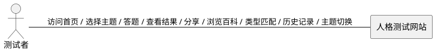
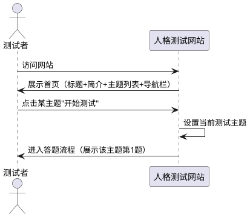
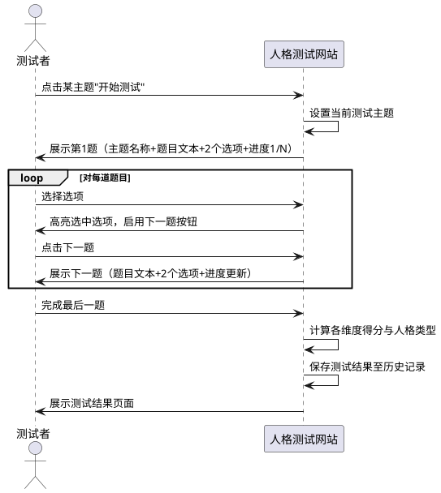
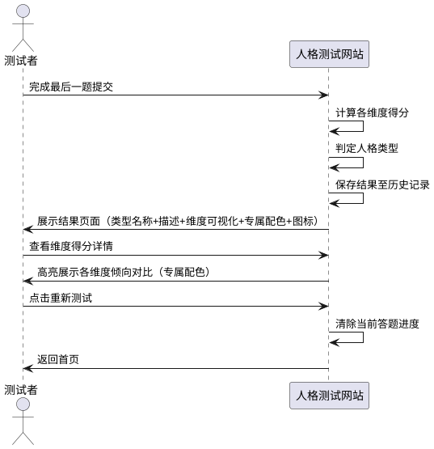
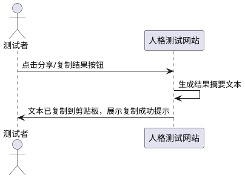
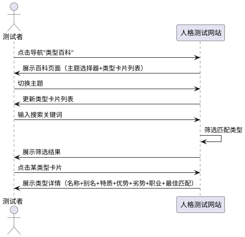
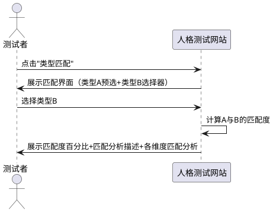
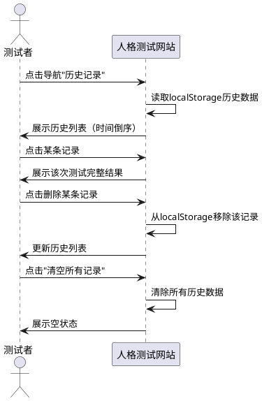
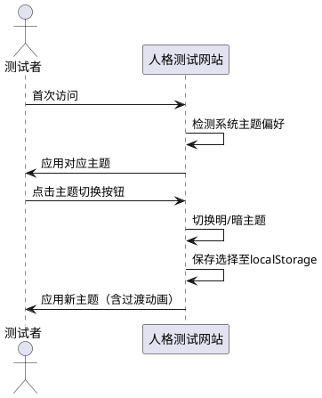
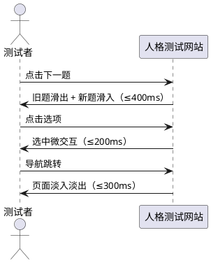

# **1. 组件定位**

## **1.1 核心职责**

本组件负责提供多主题人格测试平台，含问卷流程、结果展示、类型百科、历史记录与类型匹配，实现用户深度自我认知与社交分享的核心价值。

## **1.2 核心输入**

1. **用户答题操作**：用户在问卷流程中选择每道题目的选项
2. **用户测试主题选择**：用户在首页选择要进行的测试主题（如MBTI、大五人格、九型人格）
3. **用户重新测试请求**：用户点击重新测试按钮
4. **用户分享请求**：用户点击分享结果按钮
5. **用户百科浏览请求**：用户进入类型百科页面浏览或搜索
6. **用户匹配请求**：用户选择两种人格类型进行匹配度分析
7. **用户主题切换请求**：用户切换明暗主题
8. **用户历史记录查看请求**：用户进入历史记录页面查看过往测试结果

## **1.3 核心输出**

1. **测试进度反馈**：返回当前答题进度（第N题/总题数）
2. **人格类型结果**：返回用户的人格类型标识、名称、描述、专属配色、维度得分
3. **分享内容**：生成可分享的测试结果摘要
4. **类型百科内容**：返回指定测试主题下所有人格类型的详细介绍
5. **匹配度分析结果**：返回两种人格类型的匹配度百分比与分析描述
6. **历史记录列表**：返回用户历次测试结果摘要（含时间、主题、类型）
7. **主题样式输出**：根据明暗模式切换输出对应CSS变量集

## **1.4 职责边界**

1. 本组件**不负责**用户账号注册与登录
2. 本组件**不负责**测试数据的服务端持久化存储
3. 本组件**不负责**专业心理咨询服务
4. 本组件**不负责**多用户实时交互或社交网络功能
5. 本组件**不负责**AI驱动的自适应题目生成
6. 本组件**不负责**第三方广告或商业变现

# **2. 领域术语**

**测试主题**
: 人格测试的理论体系与题目集合，每个主题包含独立的维度定义、题目集和类型描述集。
: 备注：如MBTI、大五人格（Big Five）、九型人格（Enneagram）为不同测试主题。

**人格维度**
: 人格测试中的评价轴，每个维度包含两个对立极，用户在每个维度上的倾向由答题得分决定。
: 备注：类似MBTI的E/I、N/S等维度对；大五人格的开放性/尽责性等单维度。

**维度极**
: 人格维度的一端，代表一种倾向性。每个维度恰好有两个极。
: 备注：如"外向"和"内向"是一个维度的两个极。

**人格类型**
: 由各维度极组合而成的唯一类型标识，是测试的最终输出结果。
: 备注：如MBTI的4个维度2个极共产生16种类型；九型人格为9种类型。

**测试题目**
: 包含题目文本和两个选项的问卷单元，每道题目关联一个特定人格维度。

**维度得分**
: 用户在某一维度上的倾向量化值，由该维度关联的所有题目选项汇总计算得出。

**测试结果**
: 由人格类型、各维度得分、类型描述、专属配色组成的完整输出。

**类型百科**
: 测试主题下所有人格类型的结构化详细介绍集合，包含类型名称、别名、核心特质、优势、劣势、典型职业等。

**类型匹配度**
: 两种人格类型之间的相容性量化指标，取值0%~100%，附带匹配分析描述。
: 备注：匹配度基于维度极的一致性与互补性规则计算。

**历史记录**
: 用户历次测试的结果摘要，存储于浏览器本地，包含测试时间、主题、人格类型标识。

**明暗主题**
: 界面视觉模式，分为亮色模式（Light）和暗色模式（Dark），通过CSS变量集实现全局切换。

**专属配色**
: 每种人格类型对应的主题色方案，包含主色、辅助色和背景色，用于结果页面视觉增强。

# **3. 角色与边界**

## **3.1 核心角色**

- **测试者**：访问网站、选择测试主题、完成问卷答题、查看测试结果、浏览类型百科、进行类型匹配、查看历史记录的最终用户

## **3.2 外部系统**

无外部系统依赖。本组件为独立前端应用，无需后端服务或数据库。

## **3.3 交互上下文**

# **4. DFX约束**

## **4.1 性能**

1. The 人格测试网站 shall 在首屏加载完成后2秒内完成所有静态资源加载与页面渲染
   - EARS模式：Ubiquitous
   - 验证方式：使用Lighthouse或Performance API测量首屏加载时间 ≤ 2秒

2. The 人格测试网站 shall 在用户切换题目后200毫秒内完成新题目的渲染与交互就绪
   - EARS模式：Ubiquitous
   - 验证方式：测量从用户点击下一题到新题目可交互的时间 ≤ 200毫秒

3. The 人格测试网站 shall 在用户完成最后一题后500毫秒内完成结果计算与结果页面渲染
   - EARS模式：Ubiquitous
   - 验证方式：测量从最后一题提交到结果页面完整渲染的时间 ≤ 500毫秒

4. The 人格测试网站 shall 将静态资源总大小控制在800KB以内（不含图片资源）
   - EARS模式：Ubiquitous
   - 验证方式：构建后统计dist目录下所有静态资源总大小 ≤ 800KB

5. The 人格测试网站 shall 在页面切换后300毫秒内完成路由切换与新页面渲染
   - EARS模式：Ubiquitous
   - 验证方式：测量从路由跳转到新页面完整渲染的时间 ≤ 300毫秒

## **4.2 可靠性**

1. The 人格测试网站 shall 作为纯静态站点依赖CDN提供 ≥ 99.5%的可用性
   - EARS模式：Ubiquitous
   - 验证方式：CDN服务等级协议（SLA）确认可用性指标

2. While 用户在答题过程中浏览器标签页发生刷新，the 人格测试网站 shall 从浏览器本地存储中恢复答题进度
   - EARS模式：State-Driven
   - 验证方式：答题中刷新页面，验证恢复至刷新前未答题目且已答数据保留

3. While localStorage可用且存在历史记录数据，the 人格测试网站 shall 在历史记录页面正确展示所有记录
   - EARS模式：State-Driven
   - 验证方式：有历史记录时进入历史页面，确认所有记录完整展示

## **4.3 安全性**

1. The 人格测试网站 shall not 收集用户个人身份信息（姓名、邮箱、手机号等）
   - EARS模式：Ubiquitous
   - 验证方式：代码审查确认无个人信息收集逻辑，网络请求审查确认无相关数据传输

2. The 人格测试网站 shall not 向任何第三方服务发送用户答题数据
   - EARS模式：Ubiquitous
   - 验证方式：网络请求拦截确认无外部数据传输

3. The 人格测试网站 shall not 使用第三方追踪脚本（如Google Analytics等）
   - EARS模式：Ubiquitous
   - 验证方式：代码审查确认无第三方追踪脚本引入

## **4.4 可维护性**

1. The 人格测试网站 shall 以配置化方式定义测试主题、人格维度数量与题目数据，便于后续扩展
   - EARS模式：Ubiquitous
   - 验证方式：主题、维度和题目数据存于独立配置文件，新增主题无需改动业务逻辑代码

2. The 人格测试网站 shall 将人格类型描述文案与代码逻辑分离，便于独立更新
   - EARS模式：Ubiquitous
   - 验证方式：类型描述文案存于独立数据文件，修改文案无需重新构建应用

3. The 人格测试网站 shall 将匹配度规则与百科内容以配置化方式定义，便于更新
   - EARS模式：Ubiquitous
   - 验证方式：匹配规则与百科数据存于独立配置，修改无需重新构建

## **4.5 兼容性**

1. The 人格测试网站 shall 支持主流现代浏览器最近2个主版本（Chrome、Firefox、Safari、Edge）
   - EARS模式：Ubiquitous
   - 验证方式：在各浏览器最近2个主版本中进行功能与视觉验证

2. The 人格测试网站 shall 支持屏幕宽度320px至1920px范围内的响应式布局
   - EARS模式：Ubiquitous
   - 验证方式：在320px、768px、1024px、1920px宽度下验证布局正确性

3. The 人格测试网站 shall not 依赖需要服务端运行时的技术栈
   - EARS模式：Ubiquitous
   - 验证方式：构建产物为纯静态文件，无服务端运行时依赖

4. The 人格测试网站 shall 支持CSS `prefers-color-scheme` 媒体查询以自动适配系统明暗主题偏好
   - EARS模式：Ubiquitous
   - 验证方式：操作系统切换明暗模式后，网站自动适配对应主题

## **4.6 可访问性**

1. The 人格测试网站 shall 为所有可交互元素提供键盘可操作支持
   - EARS模式：Ubiquitous
   - 验证方式：仅使用键盘Tab/Enter可完成所有核心操作流程

# **5. 核心能力**

## **5.1 首页与测试主题选择**

### **5.1.1 业务规则**

1. **首页展示规则**：When 用户访问网站首页，the 人格测试网站 shall 展示网站标题、简介、可用测试主题列表和导航入口
   - EARS模式：Event-Driven
   - 验证方式：访问首页，确认页面包含网站标题、简介、测试主题卡片列表、导航栏

2. **测试主题列表规则**：When 首页加载完成，the 人格测试网站 shall 展示所有可用测试主题，每个主题包含主题名称、简要描述、题目数量和预计完成时间
   - EARS模式：Event-Driven
   - 验证方式：首页加载后，确认每个主题卡片包含名称、描述、题数、预计耗时

3. **主题选择进入规则**：When 用户点击某一测试主题卡片上的"开始测试"按钮，the 人格测试网站 shall 以该主题为当前测试主题，跳转至该主题的答题页面
   - EARS模式：Event-Driven
   - 验证方式：点击MBTI主题的"开始测试"，确认URL跳转至答题页且题目为MBTI题目集

4. **导航入口规则**：When 首页加载完成，the 人格测试网站 shall 在页面导航栏中提供"首页"、"类型百科"、"历史记录"入口
   - EARS模式：Event-Driven
   - 验证方式：首页加载后，确认导航栏包含三个导航入口且可点击跳转

5. **至少3个测试主题规则**：The 人格测试网站 shall 提供至少3个测试主题（MBTI、大五人格、九型人格）
   - EARS模式：Ubiquitous
   - 验证方式：检查主题配置，确认主题数量 ≥ 3且包含MBTI、大五人格、九型人格

### **5.1.2 交互流程**

### **5.1.3 异常场景**

无特殊异常场景。

## **5.2 测试问卷流程**

### **5.2.1 业务规则**

1. **题目数量规则**：The 人格测试网站 shall 为每个测试主题包含至少8道测试题目，且每道题目必须关联一个明确的人格维度
   - EARS模式：Ubiquitous
   - 验证方式：检查各主题题目配置数据，确认每个主题题目总数 ≥ 8，且每题均关联有效维度标识

2. **选项数量规则**：When 渲染任意一道题目，the 人格测试网站 shall 恰好展示2个选项
   - EARS模式：Event-Driven
   - 验证方式：遍历所有主题的所有题目，确认每题仅展示2个可点击选项

3. **选项对应维度极规则**：While 渲染某道关联维度D的题目，the 人格测试网站 shall 将该题的两个选项分别对应维度D的两个极
   - EARS模式：State-Driven
   - 验证方式：检查题目配置，确认每题选项A和选项B分别对应所属维度的极A和极B

4. **选项选择高亮规则**：When 用户点击某道题目的一个选项，the 人格测试网站 shall 高亮显示该选中项并取消另一选项的高亮状态
   - EARS模式：Event-Driven
   - 验证方式：点击选项A，确认A高亮且B不高亮；再点击B，确认B高亮且A不高亮

5. **必答校验规则**：If 用户未选择当前题目选项而尝试进入下一题，the 人格测试网站 shall 禁止跳转并提示"请先选择一个选项"
   - EARS模式：Unwanted Behavior
   - 验证方式：未选选项时点击下一题，确认页面不跳转且显示提示信息

6. **禁止跳题规则**：The 人格测试网站 shall not 提供跳过当前题目的功能
   - EARS模式：Ubiquitous
   - 验证方式：确认答题页面无"跳过"按钮，且无快捷键可跳题

7. **进度展示规则**：When 用户进入第N题，the 人格测试网站 shall 在进度指示器中显示"N/总题数"
   - EARS模式：Event-Driven
   - 验证方式：进入第3题，确认进度指示器显示"3/总题数"

8. **维度覆盖规则**：The 人格测试网站 shall 确保每个测试主题的每个维度至少关联2道题目
   - EARS模式：Ubiquitous
   - 验证方式：检查各主题题目配置，统计每个维度关联题目数，确认均 ≥ 2

9. **主题标识展示规则**：While 用户在答题流程中，the 人格测试网站 shall 在答题页面顶部展示当前测试主题名称
   - EARS模式：State-Driven
   - 验证方式：答题页面顶部显示当前主题名称（如"MBTI人格测试"）

### **5.2.2 交互流程**

### **5.2.3 异常场景**

1. **浏览器标签页意外刷新**

   a. 触发条件：用户在答题过程中刷新浏览器页面

   b. 系统行为：While localStorage可用且存在答题进度数据，the 人格测试网站 shall 从localStorage恢复已答题进度并定位到刷新前的未答题目

   c. 用户感知：页面恢复到刷新前正在作答的题目，已答题目无需重答

2. **本地存储不可用**

   a. 触发条件：浏览器禁用localStorage或处于隐私模式

   b. 系统行为：If localStorage不可用，the 人格测试网站 shall 正常提供答题流程且不提供进度恢复功能

   c. 用户感知：正常答题，刷新后需重新开始测试

## **5.3 测试结果计算与展示**

### **5.3.1 业务规则**

1. **维度得分计算规则**：When 用户完成所有题目，the 人格测试网站 shall 将各维度关联题目的选项选择汇总为该维度两极的得分（得分 = 该极对应选项被选次数）
   - EARS模式：Event-Driven
   - 验证方式：完成全部题目后，逐维度核对选择次数与计算得分一致

2. **人格类型判定规则**：While 各维度得分已计算完成，the 人格测试网站 shall 取每个维度得分较高的极作为该维度结果极，将所有维度结果极组合为用户的人格类型
   - EARS模式：State-Driven
   - 验证方式：完成测试后，确认结果类型标识等于各维度高分极标识拼接

3. **得分相等处理规则**：If 某维度两个极的得分相等，the 人格测试网站 shall 取该维度定义中的第一个极作为该维度的结果极
   - EARS模式：Unwanted Behavior
   - 验证方式：构造答题数据使某维度两极得分相等，确认结果取第一极

4. **结果展示规则**：When 结果计算完成并进入结果页面，the 人格测试网站 shall 展示人格类型名称、类型描述、各维度得分可视化图表、专属配色、类型图标和"重新测试"按钮
   - EARS模式：Event-Driven
   - 验证方式：完成测试后确认结果页面包含类型名称、描述、维度可视化、专属配色、图标、重新测试按钮

5. **维度可视化规则**：While 用户在结果页面查看维度得分区域，the 人格测试网站 shall 为每个维度提供可视化方式展示两极得分对比（进度条形式），且使用该类型的专属配色
   - EARS模式：State-Driven
   - 验证方式：确认每个维度均有进度条展示两极对比，高分侧有视觉强调，维度名称和两极标签清晰可见，配色与类型专属配色一致

6. **重新测试规则**：When 用户点击"重新测试"按钮，the 人格测试网站 shall 清除当前答题进度数据并跳转回网站首页
   - EARS模式：Event-Driven
   - 验证方式：点击重新测试，确认当前答题进度被清除、页面跳转至首页

7. **结果自动保存规则**：When 测试结果计算完成，the 人格测试网站 shall 自动将本次测试结果保存至历史记录（localStorage）
   - EARS模式：Event-Driven
   - 验证方式：完成测试后，检查localStorage中历史记录包含本次结果

8. **专属配色应用规则**：While 用户在结果页面查看内容，the 人格测试网站 shall 将该人格类型的专属配色（主色、辅助色、背景色）应用于结果页面的视觉呈现
   - EARS模式：State-Driven
   - 验证方式：确认结果页面背景、标题、进度条等元素使用该类型专属配色

### **5.3.2 交互流程**

### **5.3.3 异常场景**

1. **答题数据不完整**

   a. 触发条件：用户通过URL直接访问结果页面但未完成所有题目

   b. 系统行为：If 用户无完整答题数据而访问结果页面，the 人格测试网站 shall 重定向至测试首页

   c. 用户感知：自动跳转至首页，可选展示提示"请先完成测试"

## **5.4 结果分享**

### **5.4.1 业务规则**

1. **分享内容规则**：When 用户点击分享/复制按钮，the 人格测试网站 shall 生成包含测试主题名称、人格类型名称与标志性描述的文本摘要并写入系统剪贴板
   - EARS模式：Event-Driven
   - 验证方式：点击分享按钮后，读取剪贴板内容，确认包含主题名称、类型名称和描述

2. **复制成功提示规则**：When 测试结果摘要成功写入剪贴板，the 人格测试网站 shall 展示"复制成功"提示
   - EARS模式：Event-Driven
   - 验证方式：剪贴板写入成功后，确认页面出现成功提示

3. **禁止自动分享规则**：The 人格测试网站 shall not 在用户未点击分享按钮时触发任何分享行为
   - EARS模式：Ubiquitous
   - 验证方式：浏览结果页面不点击分享，确认剪贴板内容未被修改

4. **剪贴板失败降级规则**：If 浏览器安全策略阻止剪贴板写入，the 人格测试网站 shall 展示结果文本供用户手动选择复制，并提示"请手动选择并复制"
   - EARS模式：Unwanted Behavior
   - 验证方式：模拟剪贴板API拒绝场景，确认展示可手动选择的文本区域和提示

### **5.4.2 交互流程**

### **5.4.3 异常场景**

1. **剪贴板复制失败**

   a. 触发条件：浏览器安全策略阻止剪贴板写入

   b. 系统行为：展示结果文本供用户手动选择复制

   c. 用户感知：提示"请手动选择并复制以下内容"，展示可选择的文本区域

## **5.5 类型百科**

### **5.5.1 业务规则**

1. **百科入口规则**：When 用户点击导航栏中的"类型百科"，the 人格测试网站 shall 跳转至类型百科页面
   - EARS模式：Event-Driven
   - 验证方式：点击导航"类型百科"，确认URL跳转至百科页面

2. **主题筛选规则**：When 用户进入类型百科页面，the 人格测试网站 shall 展示测试主题选择器（默认选中第一个主题）和该主题下所有人格类型的卡片列表
   - EARS模式：Event-Driven
   - 验证方式：进入百科页面，确认显示主题选择器和当前主题的类型卡片列表

3. **主题切换规则**：When 用户在百科页面切换测试主题，the 人格测试网站 shall 更新类型卡片列表为所选主题下的所有人格类型
   - EARS模式：Event-Driven
   - 验证方式：切换主题至"大五人格"，确认卡片列表更新为大五人格类型

4. **类型卡片规则**：While 类型百科页面展示某主题的类型列表，the 人格测试网站 shall 为每个人格类型展示包含类型名称、核心特质标签和专属配色的卡片
   - EARS模式：State-Driven
   - 验证方式：确认每个类型卡片包含名称、核心特质标签、且使用专属配色

5. **类型详情规则**：When 用户点击某一类型卡片，the 人格测试网站 shall 展示该类型的详细介绍，包含类型名称、别名、核心特质、优势、劣势、典型职业和与该类型匹配度最高的类型
   - EARS模式：Event-Driven
   - 验证方式：点击INTJ卡片，确认详情页包含名称、别名、核心特质、优势、劣势、典型职业、最佳匹配类型

6. **搜索规则**：When 用户在百科页面的搜索框输入关键词，the 人格测试网站 shall 在当前主题的类型列表中筛选出名称或核心特质包含关键词的类型并展示
   - EARS模式：Event-Driven
   - 验证方式：搜索"战略"，确认结果仅显示名称或特质含"战略"的类型

7. **空搜索结果规则**：If 搜索关键词未匹配到任何类型，the 人格测试网站 shall 展示"未找到匹配的人格类型"提示
   - EARS模式：Unwanted Behavior
   - 验证方式：搜索"xyz123"，确认显示"未找到匹配的人格类型"

8. **百科内容完整性规则**：The 人格测试网站 shall 为每个测试主题下的每个人格类型提供完整的百科内容（名称、核心特质、优势、劣势、典型职业）
   - EARS模式：Ubiquitous
   - 验证方式：检查各主题百科配置，确认每个类型均有完整字段

### **5.5.2 交互流程**

### **5.5.3 异常场景**

1. **搜索无结果**

   a. 触发条件：搜索关键词未匹配到任何类型

   b. 系统行为：展示"未找到匹配的人格类型"提示

   c. 用户感知：搜索结果区域显示空状态提示文案

## **5.6 类型匹配**

### **5.6.1 业务规则**

1. **匹配入口规则**：When 用户在结果页面点击"类型匹配"或在百科页面点击"匹配分析"，the 人格测试网站 shall 展示类型匹配界面
   - EARS模式：Event-Driven
   - 验证方式：点击"类型匹配"按钮，确认显示匹配界面

2. **匹配类型选择规则**：When 用户进入类型匹配界面，the 人格测试网站 shall 展示当前用户的人格类型（已预选）和另一类型选择器，选择器列出当前测试主题下的所有人格类型
   - EARS模式：Event-Driven
   - 验证方式：进入匹配界面，确认一端预选用户类型，另一端可选择所有类型

3. **跨主题匹配规则**：While 用户进行类型匹配，the 人格测试网站 shall 仅允许同一测试主题下的两种类型进行匹配
   - EARS模式：State-Driven
   - 验证方式：MBTI结果页的匹配界面只能选择MBTI的其他类型，不能选择大五人格类型

4. **匹配度计算规则**：When 用户选择了两种人格类型，the 人格测试网站 shall 根据预定义的匹配度规则计算两种类型的匹配度百分比（0%~100%）并展示匹配分析描述
   - EARS模式：Event-Driven
   - 验证方式：选择INTJ和ENFP，确认显示匹配度百分比和分析描述

5. **匹配度展示规则**：While 匹配度计算完成，the 人格测试网站 shall 以可视化方式（环形进度图或进度条）展示匹配度百分比，并展示匹配维度逐一分析
   - EARS模式：State-Driven
   - 验证方式：确认匹配度以环形图/进度条展示，下方有各维度匹配分析

6. **双向查看规则**：When 用户完成一次匹配后切换两种类型的顺序，the 人格测试网站 shall 展示相同的匹配度百分比（匹配度具有对称性）
   - EARS模式：Event-Driven
   - 验证方式：A匹配B与B匹配A的匹配度百分比相同

### **5.6.2 交互流程**

### **5.6.3 异常场景**

无特殊异常场景（同一类型匹配自身时匹配度为100%）。

## **5.7 历史记录**

### **5.7.1 业务规则**

1. **历史入口规则**：When 用户点击导航栏中的"历史记录"，the 人格测试网站 shall 跳转至历史记录页面
   - EARS模式：Event-Driven
   - 验证方式：点击导航"历史记录"，确认URL跳转至历史页面

2. **历史列表展示规则**：While 用户进入历史记录页面且localStorage中存在历史记录数据，the 人格测试网站 shall 按时间倒序展示所有历史记录，每条记录包含测试时间、测试主题、人格类型名称和专属配色标记
   - EARS模式：State-Driven
   - 验证方式：进入历史页面，确认记录按时间从新到旧排列，每条包含时间、主题、类型名、配色

3. **历史详情跳转规则**：When 用户点击某条历史记录，the 人格测试网站 shall 展示该次测试的完整结果（类型名称、描述、维度得分可视化、专属配色）
   - EARS模式：Event-Driven
   - 验证方式：点击历史记录，确认展示完整测试结果

4. **空历史状态规则**：If localStorage中无历史记录数据，the 人格测试网站 shall 在历史记录页面展示"暂无测试记录，快去做个人格测试吧"提示和"去测试"按钮
   - EARS模式：Unwanted Behavior
   - 验证方式：清除localStorage后进入历史页面，确认显示空状态提示和"去测试"按钮

5. **历史记录数量上限规则**：The 人格测试网站 shall 在localStorage中最多保存最近20条历史记录，超出时自动删除最旧的记录
   - EARS模式：Ubiquitous
   - 验证方式：添加21条记录后，确认仅保留最近20条

6. **删除历史记录规则**：When 用户点击某条历史记录的删除按钮，the 人格测试网站 shall 从localStorage中移除该条记录并更新页面展示
   - EARS模式：Event-Driven
   - 验证方式：点击删除按钮，确认该记录从列表中移除

7. **清空历史规则**：When 用户点击"清空所有记录"按钮，the 人格测试网站 shall 清除localStorage中所有历史记录数据并展示空状态
   - EARS模式：Event-Driven
   - 验证方式：点击清空按钮，确认所有记录被清除且展示空状态

8. **历史记录不可用降级规则**：If localStorage不可用，the 人格测试网站 shall 在历史记录页面展示"浏览器存储不可用，无法保存历史记录"提示
   - EARS模式：Unwanted Behavior
   - 验证方式：禁用localStorage后进入历史页面，确认显示存储不可用提示

### **5.7.2 交互流程**

### **5.7.3 异常场景**

1. **localStorage不可用**

   a. 触发条件：浏览器禁用localStorage或处于隐私模式

   b. 系统行为：展示"浏览器存储不可用，无法保存历史记录"提示

   c. 用户感知：历史记录页面显示存储不可用提示，无法查看历史

2. **历史数据损坏**

   a. 触发条件：localStorage中的历史记录数据格式异常（如手动篡改）

   b. 系统行为：忽略损坏的记录，仅展示有效记录；若全部损坏则展示空状态

   c. 用户感知：正常记录可查看，异常记录不显示

## **5.8 明暗主题切换**

### **5.8.1 业务规则**

1. **主题切换入口规则**：When 用户点击页面上的明暗主题切换按钮，the 人格测试网站 shall 切换当前界面主题（亮色↔暗色）并保存用户选择至localStorage
   - EARS模式：Event-Driven
   - 验证方式：点击切换按钮，确认界面在亮色和暗色间切换，刷新后保持选择

2. **默认主题规则**：When 用户首次访问网站且localStorage中无主题偏好记录，the 人格测试网站 shall 根据系统`prefers-color-scheme`媒体查询自动选择明暗主题
   - EARS模式：Event-Driven
   - 验证方式：首次访问且系统为暗色模式，确认网站默认为暗色主题

3. **主题持久化规则**：While localStorage可用且存在用户主题偏好，the 人格测试网站 shall 在页面加载时应用用户上次选择的主题
   - EARS模式：State-Driven
   - 验证方式：选择暗色主题后刷新页面，确认仍为暗色主题

4. **全局主题应用规则**：While 明暗主题已确定，the 人格测试网站 shall 通过CSS变量将主题应用于所有页面的背景、文字、卡片、按钮等视觉元素
   - EARS模式：State-Driven
   - 验证方式：切换主题后，确认所有页面元素的配色同步更新

5. **主题切换过渡规则**：When 用户切换明暗主题，the 人格测试网站 shall 在300毫秒内完成主题过渡动画
   - EARS模式：Event-Driven
   - 验证方式：切换主题后，确认过渡动画在300毫秒内完成

### **5.8.2 交互流程**

### **5.8.3 异常场景**

1. **localStorage不可用**

   a. 触发条件：浏览器禁用localStorage

   b. 系统行为：正常提供主题切换功能，但不持久化用户选择，刷新后回退至系统默认

   c. 用户感知：可切换主题，但刷新后恢复为系统默认主题

## **5.9 页面过渡与交互动效**

### **5.9.1 业务规则**

1. **题目切换过渡规则**：When 用户在答题流程中进入下一题，the 人格测试网站 shall 展示题目滑出/滑入过渡动画，动画时长不超过400毫秒
   - EARS模式：Event-Driven
   - 验证方式：点击下一题，确认旧题滑出、新题滑入，动画时长 ≤ 400毫秒

2. **选项选中反馈规则**：When 用户点击题目选项，the 人格测试网站 shall 展示选中微交互动效（缩放或涟漪效果），动效时长不超过200毫秒
   - EARS模式：Event-Driven
   - 验证方式：点击选项，确认出现选中动效，时长 ≤ 200毫秒

3. **页面路由过渡规则**：When 用户通过导航在不同页面间切换，the 人格测试网站 shall 展示页面淡入淡出过渡效果，过渡时长不超过300毫秒
   - EARS模式：Event-Driven
   - 验证方式：点击导航跳转，确认页面淡入淡出，时长 ≤ 300毫秒

4. **减弱动效偏好规则**：Where 用户系统设置了`prefers-reduced-motion`偏好，the 人格测试网站 shall 禁用或大幅简化所有过渡动画
   - EARS模式：Optional Feature
   - 验证方式：系统开启减弱动效后，确认无动画或仅瞬间切换

### **5.9.2 交互流程**

### **5.9.3 异常场景**

无特殊异常场景。

# **6. 数据约束**

## **6.1 测试主题**

1. **主题标识**：唯一标识符，格式为小写英文字母与连字符，长度2~20个字符（如"mbti"、"big-five"、"enneagram"）
2. **主题名称**：主题的显示名称，非空字符串，长度 ≤ 20个字符
3. **主题描述**：主题的简要介绍，非空字符串，长度 ≤ 200个字符
4. **预计完成时间**：该主题测试的预计耗时，格式为"约X分钟"
5. **主题数量**：至少3个主题

## **6.2 人格维度**

1. **维度标识**：唯一标识符，格式为英文大写字母，长度1~3个字符
2. **维度名称**：维度的显示名称，非空字符串，长度 ≤ 10个字符
3. **极A名称**：维度第一极的显示名称，非空字符串，长度 ≤ 10个字符
4. **极B名称**：维度第二极的显示名称，非空字符串，长度 ≤ 10个字符
5. **维度数量**：每个主题至少2个维度，最多6个维度

## **6.3 测试题目**

1. **题目序号**：正整数，从1开始连续递增
2. **题目文本**：题目的描述文字，非空字符串，长度 ≤ 100个字符
3. **选项A文本**：第一选项的描述文字，非空字符串，长度 ≤ 50个字符
4. **选项B文本**：第二选项的描述文字，非空字符串，长度 ≤ 50个字符
5. **关联维度**：该题目关联的人格维度标识，必须为已定义的维度之一
6. **选项A关联极**：选项A对应的维度极，必须为该维度的极A或极B
7. **选项B关联极**：选项B对应的维度极，必须为该维度的另一极（与选项A关联极不同）

## **6.4 人格类型**

1. **类型标识**：由各维度结果极标识拼接而成的唯一字符串
2. **类型名称**：类型的显示名称，非空字符串，长度 ≤ 20个字符
3. **类型描述**：类型的详细描述文案，非空字符串，长度 ≤ 500个字符
4. **类型数量**：等于2的维度数量次方（如4个维度则16种类型）
5. **专属配色**：包含主色（HEX格式）、辅助色（HEX格式）、背景色（HEX格式）
6. **核心特质标签**：类型核心特质列表，每项长度 ≤ 6个字符，共2~5项

## **6.5 类型百科内容**

1. **别名**：类型的别称或常用名，字符串，长度 ≤ 30个字符
2. **核心特质**：类型核心特征描述，非空字符串，长度 ≤ 200个字符
3. **优势**：类型优势列表，每项长度 ≤ 50个字符，共2~5项
4. **劣势**：类型劣势列表，每项长度 ≤ 50个字符，共2~5项
5. **典型职业**：类型适合的职业列表，每项长度 ≤ 20个字符，共2~5项
6. **最佳匹配类型**：与该类型匹配度最高的类型标识

## **6.6 匹配度规则**

1. **匹配度范围**：0%~100%，整数
2. **匹配度对称性**：类型A与类型B的匹配度 = 类型B与类型A的匹配度
3. **自匹配度**：类型与自身的匹配度 = 100%
4. **匹配分析描述**：非空字符串，长度 ≤ 200个字符

## **6.7 历史记录**

1. **记录ID**：唯一标识符，时间戳+随机数
2. **测试时间**：ISO 8601格式的日期时间
3. **测试主题标识**：对应的测试主题标识
4. **人格类型标识**：测试结果的人格类型标识
5. **维度得分快照**：各维度得分的JSON序列化数据
6. **存储位置**：仅存储于浏览器localStorage
7. **记录上限**：最多20条，超出时FIFO删除
8. **单条记录大小**：≤ 2KB

## **6.8 答题记录**

1. **当前题号**：正整数，1 ≤ 当前题号 ≤ 总题数
2. **当前测试主题标识**：当前正在进行的测试主题标识
3. **已答题目列表**：按答题顺序存储的{题目序号, 选中选项}对
4. **存储位置**：仅存储于浏览器localStorage
5. **存储有效期**：浏览器会话有效期内有效，完成测试后清除进度

## **6.9 明暗主题**

1. **主题值**：枚举，取值为"light"或"dark"
2. **存储位置**：localStorage中的theme字段
3. **默认值**：跟随系统`prefers-color-scheme`，无法检测时默认"light"

# **7. 需求追踪矩阵**

| 需求ID | 需求名称 | 优先级 | EARS模式 | 对应用户故事 | 功能模块 |
|--------|---------|--------|---------|-------------|---------|
| FR-01 | 首页与测试主题选择 | P0 | Event-Driven / Ubiquitous | US-01, US-02 | 首页 |
| FR-02 | 答题流程 | P0 | Event-Driven / State-Driven / Unwanted Behavior | US-03, US-04, US-05 | 答题流程 |
| FR-03 | 测试结果计算 | P0 | Event-Driven / State-Driven / Unwanted Behavior | US-06 | 结果计算 |
| FR-04 | 测试结果展示 | P0 | Event-Driven / State-Driven | US-06, US-07, US-08 | 结果展示 |
| FR-05 | 结果分享 | P1 | Event-Driven / Unwanted Behavior | US-09 | 结果分享 |
| FR-06 | 答题进度恢复 | P1 | State-Driven / Unwanted Behavior | US-10 | 进度恢复 |
| FR-07 | 类型百科 | P0 | Event-Driven / State-Driven / Unwanted Behavior | US-11, US-12 | 类型百科 |
| FR-08 | 类型匹配 | P1 | Event-Driven / State-Driven | US-13, US-14 | 类型匹配 |
| FR-09 | 历史记录 | P1 | Event-Driven / State-Driven / Unwanted Behavior | US-15, US-16 | 历史记录 |
| FR-10 | 明暗主题切换 | P1 | Event-Driven / State-Driven | US-17 | 主题切换 |
| FR-11 | 页面过渡与动效 | P2 | Event-Driven / Optional Feature | US-18 | 交互动效 |
| FR-12 | 非法页面访问处理 | P1 | Unwanted Behavior | US-19 | 异常处理 |
| NFR-01 | 性能 | P0 | Ubiquitous | - | 全局 |
| NFR-02 | 安全性 | P0 | Ubiquitous | - | 全局 |
| NFR-03 | 兼容性 | P0 | Ubiquitous | - | 全局 |
| NFR-04 | 可维护性 | P1 | Ubiquitous | - | 全局 |
| NFR-05 | 可靠性 | P1 | Ubiquitous / State-Driven | - | 全局 |
| NFR-06 | 可访问性 | P2 | Ubiquitous | - | 全局 |
| DC-01 | 测试主题数据约束 | P0 | - | - | 数据模型 |
| DC-02 | 人格维度数据约束 | P0 | - | - | 数据模型 |
| DC-03 | 测试题目数据约束 | P0 | - | - | 数据模型 |
| DC-04 | 人格类型数据约束 | P0 | - | - | 数据模型 |
| DC-05 | 类型百科内容约束 | P0 | - | - | 数据模型 |
| DC-06 | 匹配度规则约束 | P1 | - | - | 数据模型 |
| DC-07 | 历史记录数据约束 | P1 | - | - | 数据模型 |
| DC-08 | 答题记录数据约束 | P0 | - | - | 数据模型 |
| DC-09 | 明暗主题数据约束 | P1 | - | - | 数据模型 |

## 更新历史

| 版本 | 日期 | 修改内容 | 修改人 |
|------|------|---------|--------|
| v1.0 | 2026-05-21 | 初始版本，包含基础人格测试功能（FR-01~FR-07） | spec-requirement-agent |
| v2.0 | 2026-05-21 | 扩展版本，新增多套测试主题、类型百科、类型匹配、历史记录、明暗主题切换、交互动效6大模块（FR-08~FR-12） | spec-requirement-agent |
