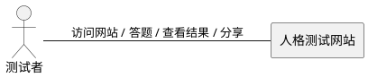
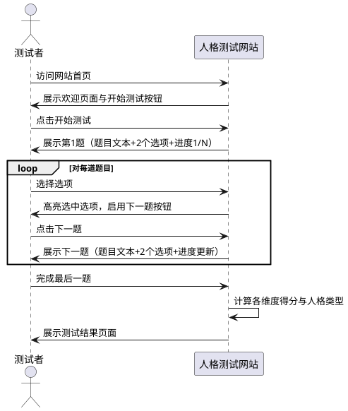
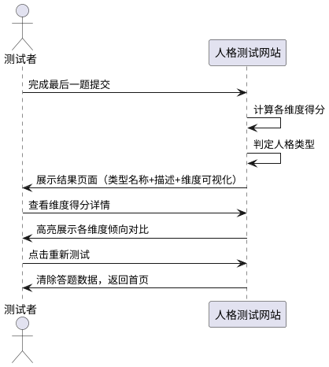
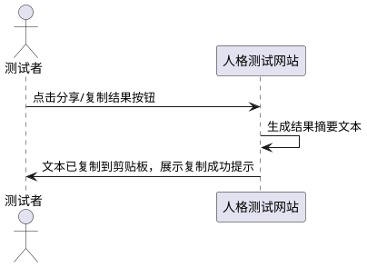
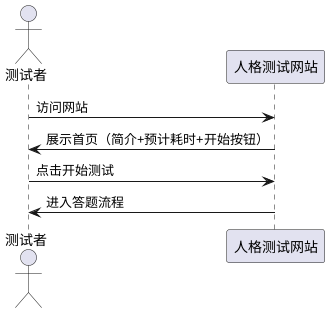

# **1. 组件定位**

## **1.1 核心职责**

本组件负责提供轻量级人格测试问卷流程与结果展示，实现用户快速了解自身人格类型的核心价值。

## **1.2 核心输入**

1. **用户答题操作**：用户在问卷流程中选择每道题目的选项
2. **用户重新测试请求**：用户点击重新测试按钮
3. **用户分享请求**：用户点击分享结果按钮

## **1.3 核心输出**

1. **测试进度反馈**：返回当前答题进度（第N题/总题数）
2. **人格类型结果**：返回用户的人格类型标识、名称、描述及维度得分
3. **分享内容**：生成可分享的测试结果摘要

## **1.4 职责边界**

1. 本组件**不负责**用户账号注册与登录
2. 本组件**不负责**测试数据的持久化存储
3. 本组件**不负责**多人测试结果对比分析
4. 本组件**不负责**测试结果的专业心理咨询服务

# **2. 领域术语**

**人格维度**
: 人格测试中的评价轴，每个维度包含两个对立极，用户在每个维度上的倾向由答题得分决定。
: 备注：类似MBTI的E/I、N/S等维度对。

**维度极**
: 人格维度的一端，代表一种倾向性。每个维度恰好有两个极。
: 备注：如"外向"和"内向"是一个维度的两个极。

**人格类型**
: 由各维度极组合而成的唯一类型标识，是测试的最终输出结果。
: 备注：如4个维度2个极共产生16种类型。

**测试题目**
: 包含题目文本和两个选项的问卷单元，每道题目关联一个特定人格维度。

**维度得分**
: 用户在某一维度上的倾向量化值，由该维度关联的所有题目选项汇总计算得出。

**测试结果**
: 由人格类型、各维度得分、类型描述组成的完整输出。

# **3. 角色与边界**

## **3.1 核心角色**

- **测试者**：访问网站、完成问卷答题、查看测试结果的最终用户

## **3.2 外部系统**

无外部系统依赖。本组件为独立前端应用，无需后端服务或数据库。

## **3.3 交互上下文**

# **4. DFX约束**

## **4.1 性能**

1. 首屏加载时间必须 ≤ 2秒（含静态资源）
2. 单题切换响应时间必须 ≤ 200毫秒
3. 测试结果计算与渲染必须 ≤ 500毫秒
4. 静态资源总大小必须 ≤ 500KB（不含图片资源）

## **4.2 可靠性**

1. 系统可用性目标 ≥ 99.5%（作为纯静态站点，依赖CDN可用性）
2. 答题进度在浏览器标签页刷新后必须能够恢复

## **4.3 安全性**

1. 禁止收集用户个人身份信息（姓名、邮箱、手机号等）
2. 禁止向任何第三方服务发送用户答题数据
3. 禁止使用第三方追踪脚本（如Google Analytics等）

## **4.4 可维护性**

1. 人格维度数量与题目数量必须以配置化方式定义，便于后续扩展
2. 人格类型描述文案必须与代码逻辑分离，便于独立更新

## **4.5 兼容性**

1. 必须支持主流现代浏览器最近2个主版本（Chrome、Firefox、Safari、Edge）
2. 必须支持移动端响应式布局（屏幕宽度320px~1920px）
3. 禁止依赖需要服务端运行时的技术栈

# **5. 核心能力**

## **5.1 测试问卷流程**

### **5.1.1 业务规则**

1. **题目数量规则**：测试必须包含至少8道题目，每道题目关联一个明确的人格维度

   a. 验收条件：[系统启动测试] → [题目总数 ≥ 8，每题均关联一个维度]

2. **选项规则**：每道题目必须提供恰好2个选项，分别对应所属维度的两个极

   a. 验收条件：[渲染任意一道题目] → [该题恰好展示2个选项]

3. **必答规则**：用户必须选择当前题目的一个选项后，方可进入下一题

   a. 验收条件：[用户未选择选项点击下一题] → [系统禁止跳转并给出提示]

4. **进度展示规则**：系统必须实时展示当前答题进度（第N题/总题数）

   a. 验收条件：[用户进入第N题] → [进度指示器显示"N/总题数"]

5. **维度覆盖规则**：每个维度至少有2道题目关联

   a. 验收条件：[检查题目配置] → [每个维度关联题目数 ≥ 2]

6. **禁止项**：禁止允许用户跳过题目

   a. 验收条件：[用户尝试跳过题目] → [系统不提供跳过功能]

### **5.1.2 交互流程**

### **5.1.3 异常场景**

1. **浏览器标签页意外刷新**

   a. 触发条件：用户在答题过程中刷新浏览器页面

   b. 系统行为：从浏览器本地存储中恢复已答题进度

   c. 用户感知：页面恢复到刷新前的最后一道未答题，已答题目无需重答

2. **本地存储不可用**

   a. 触发条件：浏览器禁用本地存储或处于隐私模式

   b. 系统行为：正常提供答题流程，但不提供进度恢复功能

   c. 用户感知：正常答题，刷新后需重新开始测试

## **5.2 测试结果计算与展示**

### **5.2.1 业务规则**

1. **维度得分计算规则**：每个维度的得分等于该维度关联的所有题目中，选择该维度极对应选项的题目数量

   a. 验收条件：[用户完成所有题目] → [各维度得分正确汇总计算]

2. **人格类型判定规则**：取每个维度得分较高的极作为该维度的结果极，所有维度结果极的组合即为用户的人格类型

   a. 验收条件：[各维度得分已计算] → [人格类型由各维度高得分极组合确定]

3. **得分相等处理规则**：当某维度两个极的得分相等时，默认取该维度定义中的第一个极作为结果极

   a. 验收条件：[某维度两极得分相等] → [取维度定义中的第一极作为结果极]

4. **结果展示规则**：测试结果页面必须展示以下内容

   a. 验收条件：[进入结果页面] → [展示：人格类型名称、类型描述、各维度得分可视化、重新测试按钮]

5. **维度可视化规则**：每个维度必须以可视化方式展示两极得分对比（如进度条、柱状图等）

   a. 验收条件：[查看维度得分区域] → [每个维度均有可视化对比展示]

### **5.2.2 交互流程**

### **5.2.3 异常场景**

1. **答题数据不完整**

   a. 触发条件：用户通过URL直接访问结果页面但未完成所有题目

   b. 系统行为：重定向至测试首页

   c. 用户感知：自动跳转至首页，提示需先完成测试

## **5.3 结果分享**

### **5.3.1 业务规则**

1. **分享内容规则**：分享内容必须包含人格类型名称与一句标志性描述

   a. 验收条件：[用户点击分享] → [分享内容包含类型名称和描述]

2. **分享方式规则**：系统必须提供将测试结果文本复制到剪贴板的功能

   a. 验收条件：[用户点击复制结果] → [测试结果摘要已复制到剪贴板]

3. **禁止项**：禁止未经用户操作自动分享测试结果

   a. 验收条件：[用户未点击分享按钮] → [不触发任何分享行为]

### **5.3.2 交互流程**

### **5.3.3 异常场景**

1. **剪贴板复制失败**

   a. 触发条件：浏览器安全策略阻止剪贴板写入

   b. 系统行为：展示结果文本供用户手动选择复制

   c. 用户感知：提示"请手动选择并复制以下内容"，展示可选择的文本区域

## **5.4 欢迎与引导**

### **5.4.1 业务规则**

1. **首页展示规则**：首页必须展示测试简介、预计耗时和开始测试入口

   a. 验收条件：[用户访问网站] → [首页展示测试简介、预计耗时、开始测试按钮]

2. **预计耗时展示规则**：必须根据题目数量给出合理的预计完成时间

   a. 验收条件：[首页加载完成] → [展示预计耗时，如"约3分钟"]

### **5.4.2 交互流程**

### **5.4.3 异常场景**

无特殊异常场景。

# **6. 数据约束**

## **6.1 人格维度**

1. **维度标识**：唯一标识符，格式为英文大写字母，长度1~3个字符
2. **维度名称**：维度的显示名称，非空字符串，长度 ≤ 10个字符
3. **极A名称**：维度第一极的显示名称，非空字符串，长度 ≤ 10个字符
4. **极B名称**：维度第二极的显示名称，非空字符串，长度 ≤ 10个字符
5. **维度数量**：至少2个维度，最多6个维度

## **6.2 测试题目**

1. **题目序号**：正整数，从1开始连续递增
2. **题目文本**：题目的描述文字，非空字符串，长度 ≤ 100个字符
3. **选项A文本**：第一选项的描述文字，非空字符串，长度 ≤ 50个字符
4. **选项B文本**：第二选项的描述文字，非空字符串，长度 ≤ 50个字符
5. **关联维度**：该题目关联的人格维度标识，必须为已定义的维度之一
6. **选项A关联极**：选项A对应的维度极，必须为该维度的极A或极B
7. **选项B关联极**：选项B对应的维度极，必须为该维度的另一极（与选项A关联极不同）

## **6.3 人格类型**

1. **类型标识**：由各维度结果极标识拼接而成的唯一字符串
2. **类型名称**：类型的显示名称，非空字符串，长度 ≤ 20个字符
3. **类型描述**：类型的详细描述文案，非空字符串，长度 ≤ 500个字符
4. **类型数量**：等于2的维度数量次方（如4个维度则16种类型）

## **6.4 答题记录**

1. **当前题号**：正整数，1 ≤ 当前题号 ≤ 总题数
2. **已答题目列表**：按答题顺序存储的{题目序号, 选中选项}对
3. **存储位置**：仅存储于浏览器本地存储（localStorage），不传输至服务端
4. **存储有效期**：浏览器会话有效期内有效，完成测试后可选择清除
