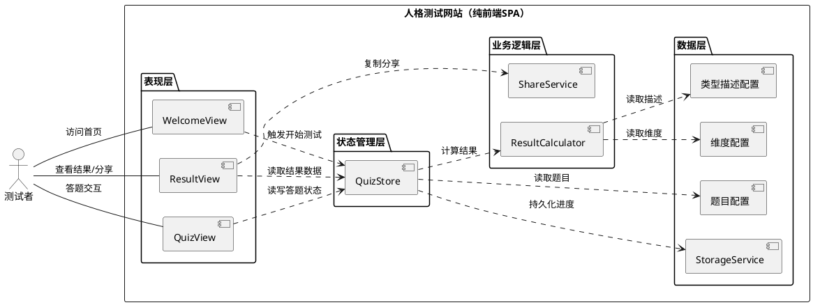
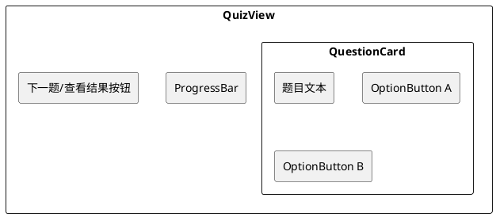
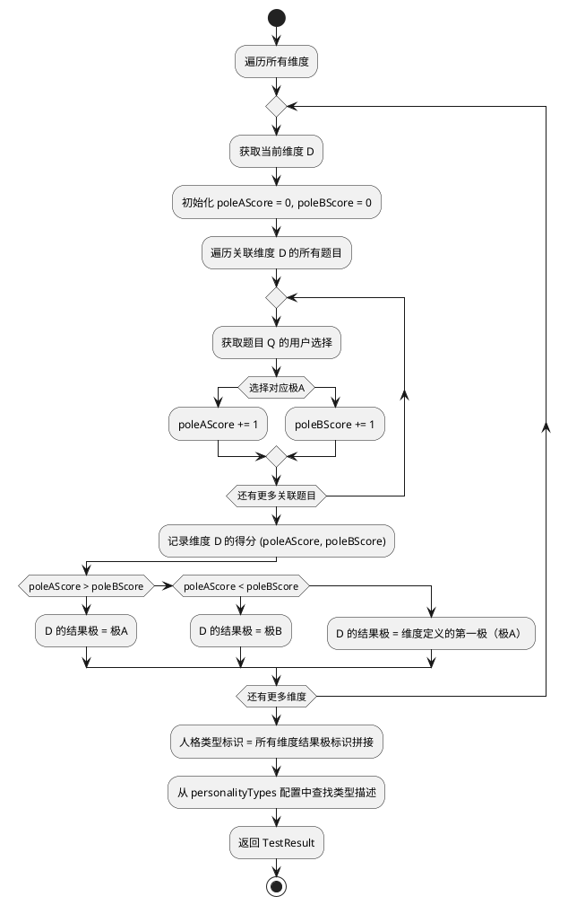

# **1. 实现模型**

## **1.1 上下文视图**

本应用为纯前端单页应用（SPA），无后端依赖。用户通过浏览器直接访问，所有逻辑在客户端完成。



### 系统边界说明

| 边界项 | 说明 |
|--------|------|
| 浏览器环境 | 应用运行在用户浏览器中，依赖 Vue 3 运行时 |
| localStorage | 唯一的外部存储依赖，用于答题进度持久化；不可用时降级为无恢复功能 |
| 剪贴板 API | 分享功能依赖 `navigator.clipboard` API；不可用时降级为手动选择复制 |
| 无服务端依赖 | 不发送任何网络请求，不收集用户数据 |

## **1.2 服务/组件总体架构**

### 1.2.1 技术栈

| 类别 | 技术选型 | 版本要求 | 选型理由 |
|------|---------|---------|---------|
| 前端框架 | Vue 3 + Composition API | ^3.4 | 轻量级、高性能，`<script setup>` 语法简洁高效 |
| 构建工具 | Vite | ^5.x | 极速冷启动、原生 ESM 支持、优秀构建产物 |
| 路由 | Vue Router | ^4.x | Vue 官方路由方案，支持路由守卫实现页面访问控制 |
| 状态管理 | Pinia | ^2.x | Vue 3 官方推荐，TypeScript 友好，轻量且直观 |
| 样式方案 | CSS/SCSS | - | 原生 CSS 变量实现主题，SCSS 辅助嵌套与复用 |
| 类型系统 | TypeScript | ^5.x | 强类型保障，避免 `any`，提升代码健壮性 |
| 部署方式 | 静态站点（CDN） | - | 纯前端产物，零服务端依赖 |

### 1.2.2 目录结构

```
personality-test/
├── index.html
├── vite.config.ts
├── tsconfig.json
├── package.json
├── src/
│   ├── App.vue                      # 根组件
│   ├── main.ts                      # 应用入口
│   ├── router/
│   │   └── index.ts                 # 路由配置与守卫
│   ├── stores/
│   │   └── quiz.ts                  # 答题状态管理（Pinia Store）
│   ├── services/
│   │   ├── resultCalculator.ts      # 结果计算服务
│   │   ├── shareService.ts          # 分享/剪贴板服务
│   │   └── storageService.ts        # localStorage 封装服务
│   ├── data/
│   │   ├── dimensions.ts            # 人格维度配置
│   │   ├── questions.ts             # 测试题目配置
│   │   └── personalityTypes.ts      # 人格类型描述配置
│   ├── types/
│   │   └── index.ts                 # 全局 TypeScript 类型定义
│   ├── views/
│   │   ├── WelcomeView.vue          # 欢迎引导页
│   │   ├── QuizView.vue             # 答题页面
│   │   └── ResultView.vue           # 结果展示页
│   ├── components/
│   │   ├── QuestionCard.vue         # 单题卡片组件
│   │   ├── OptionButton.vue         # 选项按钮组件
│   │   ├── ProgressBar.vue          # 答题进度条组件
│   │   ├── DimensionBar.vue         # 维度得分进度条组件
│   │   └── ToastMessage.vue         # 轻提示组件
│   └── styles/
│       ├── variables.scss           # 全局 SCSS 变量与 CSS 自定义属性
│       ├── mixins.scss              # SCSS 响应式 mixin
│       └── global.scss              # 全局基础样式
```

### 1.2.3 路由设计

| 路径 | 视图组件 | 说明 | 路由守卫 |
|------|---------|------|---------|
| `/` | `WelcomeView` | 欢迎引导页（默认首页） | 无 |
| `/quiz` | `QuizView` | 答题页面 | 无 |
| `/result` | `ResultView` | 结果展示页 | `beforeEnter`：检测答题数据完整性，不完整则重定向至 `/` |

路由守卫伪代码：

```typescript
// router/index.ts
const routes: RouteRecordRaw[] = [
  { path: '/', component: WelcomeView },
  { path: '/quiz', component: QuizView },
  {
    path: '/result',
    component: ResultView,
    beforeEnter: (to, from, next) => {
      const quizStore = useQuizStore()
      if (!quizStore.isQuizComplete) {
        next({ path: '/' }) // FR-07: 非法访问重定向
      } else {
        next()
      }
    }
  }
]
```

### 1.2.4 状态管理设计

使用 Pinia Store（`useQuizStore`）集中管理答题流程的全部状态：

```typescript
// stores/quiz.ts 核心状态结构
export const useQuizStore = defineStore('quiz', () => {
  // --- 状态 ---
  const currentQuestionIndex: Ref<number> = ref(0)        // 当前题目索引
  const answers: Ref<Map<number, string>> = ref(new Map()) // 已答记录：题号 → 选项ID
  const selectedOption: Ref<string | null> = ref(null)     // 当前题目选中选项
  const result: Ref<TestResult | null> = ref(null)         // 计算后的测试结果

  // --- 计算属性 ---
  const currentQuestion: ComputedRef<Question>              // 当前题目对象
  const totalQuestions: ComputedRef<number>                  // 总题数
  const progress: ComputedRef<string>                        // 进度文本 "N/总题数"
  const isQuizComplete: ComputedRef<boolean>                 // 是否已完成全部题目
  const isLastQuestion: ComputedRef<boolean>                 // 是否为最后一题

  // --- 动作 ---
  function startQuiz(): void                                // 开始测试
  function selectOption(optionId: string): void             // 选择选项
  function goToNext(): boolean                              // 进入下一题（未选返回false）
  function calculateResult(): TestResult                    // 计算测试结果
  function resetQuiz(): void                                // 重置测试

  return { /* ... */ }
})
```

## **1.3 实现设计文档**

### 1.3.1 欢迎引导页（WelcomeView）

**职责**：展示测试简介、预计完成时间，引导用户进入答题流程。

| 元素 | 类型 | 说明 |
|------|------|------|
| 测试标题 | 文本 | 网站主标题 |
| 测试简介 | 文本 | 测试目的与内容概述 |
| 预计耗时 | 文本 | 根据题目数量动态计算，如"约3分钟" |
| 开始测试按钮 | 按钮 | 点击后调用 `quizStore.startQuiz()` 并跳转 `/quiz` |

**交互逻辑**：
1. 页面加载时从 `questions.ts` 读取题目数量，计算预计耗时（每题约15秒）
2. 点击"开始测试" → `quizStore.startQuiz()` → `router.push('/quiz')`
3. 若 localStorage 中存在未完成答题进度，提示用户可选择继续或重新开始

### 1.3.2 答题页面（QuizView）

**职责**：逐题展示测试题目，收集用户选项，管理答题进度。

**组件结构**：



**QuestionCard 组件**：

| 属性 | 类型 | 说明 |
|------|------|------|
| `question` | `Question` | 当前题目数据对象 |
| `selectedOptionId` | `string \| null` | 当前选中选项ID |

| 事件 | 参数 | 说明 |
|------|------|------|
| `select` | `optionId: string` | 用户选择某选项时触发 |

**OptionButton 组件**：

| 属性 | 类型 | 说明 |
|------|------|------|
| `option` | `QuestionOption` | 选项数据对象 |
| `isSelected` | `boolean` | 是否被选中 |

| 事件 | 参数 | 说明 |
|------|------|------|
| `click` | `optionId: string` | 点击选项时触发 |

**交互逻辑**：
1. 进入页面时从 `quizStore` 获取当前题目数据渲染
2. 点击选项 → `quizStore.selectOption(optionId)` → 高亮选中项，取消另一项高亮
3. 点击"下一题" → 检查 `selectedOption` 是否为 null → 若为 null 则通过 ToastMessage 提示"请先选择一个选项"；若已选择则 `quizStore.goToNext()`
4. 最后一题选择后，按钮文案变为"查看结果" → 点击后 `quizStore.calculateResult()` → `router.push('/result')`
5. 每次操作后调用 `storageService.saveProgress()` 持久化进度

**ProgressBar 组件**：

| 属性 | 类型 | 说明 |
|------|------|------|
| `current` | `number` | 当前题号（1-indexed） |
| `total` | `number` | 总题数 |

展示格式：进度条 + 文本"N/总题数"

### 1.3.3 结果展示页（ResultView）

**职责**：展示人格类型结果、维度得分可视化，提供分享与重新测试功能。

| 区域 | 组件/内容 | 说明 |
|------|----------|------|
| 类型名称区域 | 文本 | 人格类型名称（大号字体，视觉焦点） |
| 类型描述区域 | 文本 | 人格类型的详细描述文案 |
| 维度得分区域 | `DimensionBar` × N | 每个维度一个可视化进度条 |
| 操作区域 | 分享按钮 + 重新测试按钮 | 分享与重置 |

**DimensionBar 组件**：

| 属性 | 类型 | 说明 |
|------|------|------|
| `dimension` | `Dimension` | 维度配置数据 |
| `poleAScore` | `number` | 极A得分 |
| `poleBScore` | `number` | 极B得分 |

可视化实现：CSS 进度条，两极分左右展示，高分侧加粗/加深颜色，标注得分数值与极名称。

**交互逻辑**：
1. 页面加载时从 `quizStore.result` 读取测试结果
2. 渲染类型名称、描述、各维度 DimensionBar
3. 点击"分享结果" → `shareService.copyResult(result)` → 成功则 ToastMessage 提示"复制成功"；失败则展示可手动选择复制的文本区域
4. 点击"重新测试" → `quizStore.resetQuiz()` → `router.push('/')`

### 1.3.4 结果计算服务（ResultCalculator）

**职责**：根据答题记录计算各维度得分并判定人格类型。

**算法流程**：



### 1.3.5 分享服务（ShareService）

**职责**：生成结果摘要文本并复制到剪贴板。

```typescript
// services/shareService.ts
export const shareService = {
  /**
   * 生成分享摘要文本
   */
  generateSummary(result: TestResult): string {
    return `我的人格类型是【${result.typeName}】！${result.typeDescription}`
  },

  /**
   * 复制结果到剪贴板
   * @returns true=成功, false=失败（需降级）
   */
  async copyResult(result: TestResult): Promise<boolean> {
    const text = this.generateSummary(result)
    try {
      await navigator.clipboard.writeText(text)
      return true
    } catch {
      return false
    }
  }
}
```

降级策略：`copyResult` 返回 `false` 时，ResultView 展示 `<textarea>` 供用户手动选择复制。

### 1.3.6 存储服务（StorageService）

**职责**：封装 localStorage 操作，提供答题进度的持久化与恢复。

```typescript
// services/storageService.ts
const STORAGE_KEY = 'personality-test-progress'

export const storageService = {
  /**
   * 检测 localStorage 是否可用
   */
  isAvailable(): boolean {
    try {
      const testKey = '__test__'
      localStorage.setItem(testKey, '1')
      localStorage.removeItem(testKey)
      return true
    } catch {
      return false
    }
  },

  /**
   * 保存答题进度
   */
  saveProgress(data: QuizProgress): void {
    if (!this.isAvailable()) return
    localStorage.setItem(STORAGE_KEY, JSON.stringify(data))
  },

  /**
   * 加载答题进度
   */
  loadProgress(): QuizProgress | null {
    if (!this.isAvailable()) return null
    const raw = localStorage.getItem(STORAGE_KEY)
    if (!raw) return null
    try {
      return JSON.parse(raw) as QuizProgress
    } catch {
      return null
    }
  },

  /**
   * 清除答题进度
   */
  clearProgress(): void {
    if (!this.isAvailable()) return
    localStorage.removeItem(STORAGE_KEY)
  }
}
```

### 1.3.7 提示组件（ToastMessage）

**职责**：轻量级消息提示，用于选项未选提示、复制成功反馈等。

| 属性 | 类型 | 说明 |
|------|------|------|
| `message` | `string` | 提示文本内容 |
| `duration` | `number` | 显示时长（毫秒），默认2000 |
| `visible` | `boolean` | 是否可见 |

实现方式：固定定位在页面顶部中央，CSS transition 实现淡入淡出动画。

# **2. 接口设计**

## **2.1 总体设计**

本应用为纯前端 SPA，无后端 API 接口。所有"接口"均为模块间的 TypeScript 接口/类型契约，通过函数签名与类型定义确保模块间通信的类型安全。

接口设计原则：
- **单向数据流**：视图组件从 Store 读取状态，通过调用 Store 动作修改状态
- **服务无状态**：ResultCalculator、ShareService、StorageService 均为纯函数/无状态服务
- **类型优先**：所有公共接口均通过 TypeScript 类型定义约束，禁止 `any`

## **2.2 接口清单**

### 2.2.1 Store 对外接口（useQuizStore）

| 接口 | 签名 | 说明 |
|------|------|------|
| `startQuiz` | `() => void` | 初始化答题状态，跳转第一题 |
| `selectOption` | `(optionId: string) => void` | 选择当前题目的选项 |
| `goToNext` | `() => boolean` | 进入下一题，未选选项返回 `false` |
| `calculateResult` | `() => TestResult` | 计算并缓存测试结果 |
| `resetQuiz` | `() => void` | 清除所有答题数据与结果 |
| `restoreProgress` | `() => boolean` | 从 localStorage 恢复进度，成功返回 `true` |
| `currentQuestion` | `ComputedRef<Question>` | 当前题目（计算属性） |
| `progress` | `ComputedRef<string>` | 进度文本（计算属性） |
| `isQuizComplete` | `ComputedRef<boolean>` | 是否完成全部题目（计算属性） |
| `result` | `Ref<TestResult \| null>` | 测试结果（响应式引用） |

### 2.2.2 ResultCalculator 接口

| 接口 | 签名 | 说明 |
|------|------|------|
| `calculate` | `(answers: Map<number, string>, dimensions: Dimension[], questions: Question[], types: PersonalityType[]) => TestResult` | 根据答题记录计算测试结果 |

### 2.2.3 ShareService 接口

| 接口 | 签名 | 说明 |
|------|------|------|
| `generateSummary` | `(result: TestResult) => string` | 生成分享摘要文本 |
| `copyResult` | `(result: TestResult) => Promise<boolean>` | 复制到剪贴板，返回是否成功 |

### 2.2.4 StorageService 接口

| 接口 | 签名 | 说明 |
|------|------|------|
| `isAvailable` | `() => boolean` | 检测 localStorage 是否可用 |
| `saveProgress` | `(data: QuizProgress) => void` | 保存答题进度 |
| `loadProgress` | `() => QuizProgress \| null` | 加载答题进度 |
| `clearProgress` | `() => void` | 清除答题进度 |

# **4. 数据模型**

## **4.1 设计目标**

1. **配置化驱动**：人格维度、题目、类型描述均以 TypeScript 常量配置定义，修改配置无需改动业务逻辑代码（对应 NFR-04-01、NFR-04-02）
2. **类型安全**：所有数据结构通过 TypeScript 接口严格约束，避免运行时类型错误
3. **数据与逻辑分离**：配置数据（`data/`）与业务逻辑（`services/`、`stores/`）物理分离，便于独立维护和扩展
4. **可扩展性**：维度数量、题目数量、类型描述均可通过修改配置文件扩展，无需重构代码

## **4.2 模型实现**

### 4.2.1 核心类型定义（types/index.ts）

```typescript
/**
 * 人格维度极标识
 * - 'A' 表示维度第一极
 * - 'B' 表示维度第二极
 */
type PoleId = 'A' | 'B'

/**
 * 人格维度定义
 */
interface Dimension {
  /** 维度唯一标识（英文大写字母，1~3字符） */
  id: string
  /** 维度显示名称（≤10字符） */
  name: string
  /** 第一极名称（≤10字符） */
  poleAName: string
  /** 第二极名称（≤10字符） */
  poleBName: string
  /** 第一极标识（用于类型拼接，如 'E'） */
  poleAKey: string
  /** 第二极标识（用于类型拼接，如 'I'） */
  poleBKey: string
}

/**
 * 题目选项
 */
interface QuestionOption {
  /** 选项唯一标识 */
  id: string
  /** 选项文本（≤50字符） */
  text: string
  /** 该选项对应的极（'A' 或 'B'） */
  pole: PoleId
}

/**
 * 测试题目
 */
interface Question {
  /** 题目序号（从1开始） */
  index: number
  /** 题目文本（≤100字符） */
  text: string
  /** 关联的维度ID */
  dimensionId: string
  /** 选项A（对应极A） */
  optionA: QuestionOption
  /** 选项B（对应极B） */
  optionB: QuestionOption
}

/**
 * 人格类型定义
 */
interface PersonalityType {
  /** 类型唯一标识（各维度结果极key拼接，如 'ENTJ'） */
  id: string
  /** 类型显示名称（≤20字符） */
  name: string
  /** 类型描述文案（≤500字符） */
  description: string
}

/**
 * 维度得分
 */
interface DimensionScore {
  /** 维度ID */
  dimensionId: string
  /** 维度名称 */
  dimensionName: string
  /** 极A名称 */
  poleAName: string
  /** 极B名称 */
  poleBName: string
  /** 极A得分 */
  poleAScore: number
  /** 极B得分 */
  poleBScore: number
  /** 结果极标识（用于类型拼接） */
  resultPoleKey: string
}

/**
 * 测试结果
 */
interface TestResult {
  /** 人格类型标识 */
  typeId: string
  /** 人格类型名称 */
  typeName: string
  /** 人格类型描述 */
  typeDescription: string
  /** 各维度得分列表 */
  dimensionScores: DimensionScore[]
}

/**
 * 答题进度（localStorage 持久化结构）
 */
interface QuizProgress {
  /** 当前题目索引 */
  currentQuestionIndex: number
  /** 已答记录：题号 → 选项ID */
  answers: Record<number, string>
}
```

### 4.2.2 维度配置示例（data/dimensions.ts）

```typescript
import type { Dimension } from '@/types'

/**
 * 人格维度配置
 * 约束：2~6个维度，每个维度恰好2个极
 */
export const dimensions: Dimension[] = [
  {
    id: 'EI',
    name: '能量方向',
    poleAName: '外向',
    poleBName: '内向',
    poleAKey: 'E',
    poleBKey: 'I',
  },
  {
    id: 'NS',
    name: '认知方式',
    poleAName: '直觉',
    poleBName: '感知',
    poleAKey: 'N',
    poleBKey: 'S',
  },
  {
    id: 'TF',
    name: '决策方式',
    poleAName: '思考',
    poleBName: '情感',
    poleAKey: 'T',
    poleBKey: 'F',
  },
  {
    id: 'JP',
    name: '生活态度',
    poleAName: '判断',
    poleBName: '知觉',
    poleAKey: 'J',
    poleBKey: 'P',
  },
]
```

### 4.2.3 题目配置示例（data/questions.ts）

```typescript
import type { Question } from '@/types'

/**
 * 测试题目配置
 * 约束：≥8题，每题2选项，每维度≥2题，选项分别对应两极
 */
export const questions: Question[] = [
  {
    index: 1,
    text: '在社交聚会中，你通常：',
    dimensionId: 'EI',
    optionA: { id: '1-A', text: '主动与陌生人交谈', pole: 'A' },
    optionB: { id: '1-B', text: '更愿意和熟人待在一起', pole: 'B' },
  },
  {
    index: 2,
    text: '面对新事物时，你更倾向于：',
    dimensionId: 'NS',
    optionA: { id: '2-A', text: '关注可能性和想象', pole: 'A' },
    optionB: { id: '2-B', text: '关注事实和细节', pole: 'B' },
  },
  // ... 更多题目，每维度至少2题
]
```

### 4.2.4 类型描述配置示例（data/personalityTypes.ts）

```typescript
import type { PersonalityType } from '@/types'

/**
 * 人格类型描述配置
 * 约束：类型数量 = 2^维度数，类型标识 = 各维度结果极key拼接
 */
export const personalityTypes: PersonalityType[] = [
  {
    id: 'ENTJ',
    name: '统帅型',
    description: '天生的领导者，果断坚定，善于制定长远计划并推动执行。',
  },
  {
    id: 'INFP',
    name: '调停者型',
    description: '理想主义的深思者，追求内心和谐，富有创造力和同理心。',
  },
  // ... 共16种类型
]
```

### 4.2.5 localStorage 存储设计

| 项目 | 说明 |
|------|------|
| 存储键 | `personality-test-progress` |
| 存储值 | `QuizProgress` 的 JSON 序列化字符串 |
| 写入时机 | 每次选择选项或切换题目时 |
| 读取时机 | 应用初始化时、答题页面加载时 |
| 清除时机 | 用户点击"重新测试"时 |
| 降级策略 | localStorage 不可用时跳过所有存储操作，正常答题 |

**存储数据结构**：

```json
{
  "currentQuestionIndex": 3,
  "answers": {
    "1": "1-A",
    "2": "2-B",
    "3": "3-A"
  }
}
```

### 4.2.6 数据约束校验

在开发阶段通过 TypeScript 类型系统与配置数据校验确保约束满足：

| 约束 | 校验方式 |
|------|---------|
| 维度数量 2~6 | 类型断言 + 启动时校验 |
| 题目数量 ≥ 8 | 启动时校验 |
| 每题恰好 2 选项 | TypeScript 类型定义约束 |
| 每维度 ≥ 2 题 | 启动时校验 |
| 类型数量 = 2^维度数 | 启动时校验 |
| 选项极对应正确 | 类型定义 + 配置校验 |

# **5. 视觉与响应式设计**

## **5.1 配色方案**

采用 CSS 自定义属性定义主题色，支持后续扩展暗色模式：

```scss
// styles/variables.scss
:root {
  // 主色
  --color-primary: #4A6CF7;
  --color-primary-light: #6B8AFF;
  --color-primary-dark: #3451DB;

  // 中性色
  --color-bg: #F8F9FC;
  --color-surface: #FFFFFF;
  --color-text: #1A1A2E;
  --color-text-secondary: #6B7280;
  --color-border: #E5E7EB;

  // 语义色
  --color-success: #10B981;
  --color-warning: #F59E0B;

  // 维度配色（进度条使用）
  --color-dimension-a: #4A6CF7;
  --color-dimension-b: #F472B6;
}
```

## **5.2 响应式断点**

| 断点名称 | 宽度范围 | 适用设备 |
|---------|---------|---------|
| `mobile` | 320px ~ 767px | 手机竖屏 |
| `tablet` | 768px ~ 1023px | 平板/手机横屏 |
| `desktop` | 1024px ~ 1920px | 桌面端 |

```scss
// styles/mixins.scss
@mixin mobile {
  @media (max-width: 767px) { @content; }
}
@mixin tablet {
  @media (min-width: 768px) and (max-width: 1023px) { @content; }
}
@mixin desktop {
  @media (min-width: 1024px) { @content; }
}
```

## **5.3 布局策略**

| 页面 | 布局方式 | 说明 |
|------|---------|------|
| 欢迎页 | 居中单列 | 内容垂直居中，最大宽度 480px |
| 答题页 | 居中单列 | 题目卡片居中，最大宽度 600px |
| 结果页 | 居中单列 | 类型名称+描述居中，维度条最大宽度 640px |

所有页面均采用移动优先（Mobile-First）设计，内容区水平居中，`max-width` 限制最大宽度，两侧自动留白。

## **5.4 关键组件样式规格**

| 组件 | 移动端 | 桌面端 |
|------|--------|--------|
| 开始测试按钮 | 宽度100%，高度48px | 宽度auto，最小宽度200px，高度48px |
| 选项按钮 | 宽度100%，竖向排列 | 宽度100%，竖向排列（保持一致体验） |
| 进度条 | 宽度100% | 宽度100% |
| 维度得分条 | 宽度100% | 宽度100% |
| 类型名称 | font-size: 28px | font-size: 36px |
| 题目文本 | font-size: 18px | font-size: 20px |

# **6. 任务拆解与实现步骤**

## **6.1 任务列表**

| 序号 | 任务 | 优先级 | 依赖 | 预估工时 | 对应需求 |
|------|------|--------|------|---------|---------|
| T-01 | 项目初始化（Vite + Vue3 + TS + Pinia + Vue Router） | P0 | 无 | 10min | - |
| T-02 | 定义 TypeScript 类型（types/index.ts） | P0 | T-01 | 15min | DC-01~04 |
| T-03 | 编写维度配置（data/dimensions.ts） | P0 | T-02 | 10min | DC-01 |
| T-04 | 编写题目配置（data/questions.ts） | P0 | T-02, T-03 | 20min | DC-02 |
| T-05 | 编写类型描述配置（data/personalityTypes.ts） | P0 | T-02, T-03 | 30min | DC-03 |
| T-06 | 实现 StorageService | P1 | T-02 | 15min | FR-06 |
| T-07 | 实现 ResultCalculator | P0 | T-02, T-03 | 20min | FR-03 |
| T-08 | 实现 ShareService | P1 | T-02 | 10min | FR-05 |
| T-09 | 实现 QuizStore（Pinia） | P0 | T-02, T-06, T-07 | 25min | FR-02, FR-03 |
| T-10 | 配置路由与守卫 | P0 | T-09 | 10min | FR-07 |
| T-11 | 实现全局样式与响应式 mixin | P0 | T-01 | 15min | NFR-03 |
| T-12 | 实现 ToastMessage 组件 | P0 | T-01 | 10min | FR-02 |
| T-13 | 实现 WelcomeView 欢迎页 | P0 | T-09, T-11 | 20min | FR-01 |
| T-14 | 实现 ProgressBar 组件 | P0 | T-02 | 10min | FR-02 |
| T-15 | 实现 OptionButton 组件 | P0 | T-02, T-11 | 15min | FR-02 |
| T-16 | 实现 QuestionCard 组件 | P0 | T-14, T-15 | 15min | FR-02 |
| T-17 | 实现 QuizView 答题页 | P0 | T-09, T-12, T-16 | 25min | FR-02 |
| T-18 | 实现 DimensionBar 组件 | P0 | T-02, T-11 | 15min | FR-04 |
| T-19 | 实现 ResultView 结果页 | P0 | T-09, T-08, T-12, T-18 | 25min | FR-04, FR-05 |
| T-20 | 路由整合与页面联调 | P0 | T-10, T-13, T-17, T-19 | 15min | 全流程 |
| T-21 | 响应式适配验证与修复 | P0 | T-20 | 15min | NFR-03 |
| T-22 | 构建产物体积验证 | P0 | T-20 | 5min | NFR-01-04 |

## **6.2 实现阶段**

### 阶段一：基础设施（T-01 ~ T-05）
搭建项目脚手架，完成类型定义与配置数据编写，为后续开发提供类型安全基础与数据驱动能力。

### 阶段二：核心服务（T-06 ~ T-10）
实现 StorageService、ResultCalculator、ShareService 三大服务与 QuizStore 状态管理，建立业务逻辑骨架。

### 阶段三：视图组件（T-11 ~ T-19）
从全局样式与基础组件开始，逐层实现欢迎页、答题页、结果页及其子组件。

### 阶段四：集成与验证（T-20 ~ T-22）
路由整合、全流程联调、响应式适配验证、构建产物体积验证。

## **6.3 关键技术决策**

| 决策项 | 选择 | 理由 |
|--------|------|------|
| 答题记录存储结构 | `Map<number, string>`（运行时）→ `Record<number, string>`（序列化） | Map 查询效率 O(1)，序列化时转为普通对象兼容 JSON |
| 进度持久化策略 | 每次操作后同步写入 localStorage | 确保刷新时不丢失最新进度，操作开销极小 |
| 结果计算时机 | 完成最后一题时同步计算 | 计算量极小（≤12题），同步计算耗时 < 1ms，无需异步 |
| 组件通信方式 | Pinia Store 单一数据源 | 避免组件间直接通信的复杂度，状态可预测 |
| CSS 方案 | CSS 自定义属性 + SCSS mixin | 自定义属性支持运行时主题切换，SCSS 辅助编写效率 |
| 题目切换动画 | Vue `<Transition>` 组件 | P2 需求，使用 Vue 内置过渡组件，零额外依赖 |
